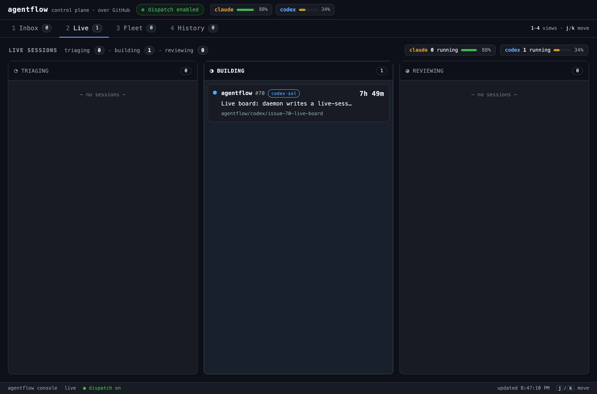

# AgentFlow

[](https://github.com/ConnorGriffin/agentflow/actions/workflows/ci.yml)
[](LICENSE)
[](docs/public-beta.md)
[](https://github.com/sponsors/ConnorGriffin)

AgentFlow turns GitHub issues into agent-built, reviewed pull requests using
Claude Code, Codex, or both. Each repository chooses how far automation may go.

> **macOS beta:** AgentFlow launches authenticated local coding agents, GitHub
> CLI, Git, and uv. Run it only on a machine where unattended coding sessions
> are acceptable.



## How it works

1. **Intake** turns an issue into a grounded Agent Brief.
2. **Build** gives Claude or Codex an isolated worktree and the brief.
3. **Review** sends the exact pull-request head to the other tool when required.
4. **Gate** merges the result or leaves a clear human action, based on the
   repository's autonomy profile.

The daemon coordinates the work. The read-only console shows provider capacity,
work in flight, repositories awaiting attention, recent merges, and trust-ratchet
state.

## Autonomy profiles

| Profile | Grounding and review | Merge authority |
| --- | --- | --- |
| `autonomous` | Agent grounding; mandatory cross-tool exact-head review | Auto-merge after green CI and a clean, untainted review |
| `reviewed` | Agent grounding; cross-tool review when available | Human glances, then merges |
| `guarded` | Mandatory real-data or running-app grounding; dual-tool or human review | Human merges after full review |

New repositories default to `reviewed`. A repository declares its profile with
`profile: autonomous`, `profile: reviewed`, or `profile: guarded` in its
`AGENTS.md` or `CLAUDE.md`.

## Quick start

### Requirements

- macOS
- Python 3.11 or newer and [uv](https://docs.astral.sh/uv/)
- Git and an authenticated [GitHub CLI](https://cli.github.com/)
- At least one authenticated Claude Code or Codex installation
- For UI repository enrollment: Node.js 18 or newer, npm, and npx (Node.js 20
  or newer is recommended)

Both providers are required for automatic cross-tool review in the
`autonomous` profile. With one provider, AgentFlow can still build work;
`reviewed` repositories may use a fresh same-tool review and still require a
human merge.

### Install

```bash
git clone https://github.com/ConnorGriffin/agentflow.git
cd agentflow
uv sync --group dev
```

The built console is tracked in the clone. Headless repository enrollment needs
no Node.js, npm, or npx. UI enrollment requires them and installs pinned
Playwright and Chromium tooling. Console development also requires Node.js.

### Enroll a repository

Start with a clean checkout of the repository you want AgentFlow to manage.
Inspect its current readiness:

```bash
uv run agentflow doctor --repo /absolute/path/to/repository
```

The first check may report missing setup. Preview the files and capabilities
AgentFlow would add, then apply them:

```bash
uv run agentflow enroll /absolute/path/to/repository --profile reviewed
uv run agentflow enroll /absolute/path/to/repository --profile reviewed --apply
```

Review and commit the generated files in the target repository. Then verify the
repository and AgentFlow configuration:

```bash
uv run agentflow doctor --repo /absolute/path/to/repository
uv run agentflow check
```

Enrollment does not create GitHub queue labels or harden public-pull-request CI.
Complete the printed GitHub verification step before starting the daemon.

See [repository capabilities](docs/capabilities.md) for the generated contract,
skill manifest, UI tooling, and optional integrations.

### Calibrate provider capacity

AgentFlow reads provider-authored capacity facts from the authenticated Claude
and Codex session histories already on the machine. It does not contact a
separate service.

If you use Claude, calibrate its five-hour baseline once:

```bash
uv run agentflow capacity calibrate
```

Re-run calibration after materially changing the Claude plan. Codex reports
typed rate-limit windows and needs no calibration. Missing or unreadable facts
fail closed.

### Start

```bash
uv run agentflow service install
uv run agentflow status
uv run agentflow resume
uv run agentflow console
```

The LaunchAgent starts paused and submits no new work until `agentflow resume`.
Use `agentflow pause` before maintenance.

`service install` writes `~/Library/LaunchAgents/agentflow.daemon.plist`.
Daemon output goes to `~/Library/Logs/agentflow.log`. Re-run the install command
after changing paths, environment, or the AgentFlow checkout.

## Skills and repository capabilities

AgentFlow is not a bundle or wrapper for Matt Pocock's skills. Its issue-to-PR
engine is Python. It shares the broader method of turning repeatable agent work
into explicit, reviewable skills.

Enrollment installs AgentFlow's bundled operating skill inside each repository.
For UI repositories, it also installs pinned `ui-mockups` and
`drive-local-webapp` skills, a screenshot harness, and the required browser
runtime.

The UI skills are also available independently from
[Connor Griffin's public skills repository](https://github.com/ConnorGriffin/skills):

```bash
npx skills add ConnorGriffin/skills \
  --skill ui-mockups \
  --skill drive-local-webapp
```

[Codebase Memory onboarding](https://github.com/ConnorGriffin/skills/tree/main/skills/cbm-onboard)
and [Matt Pocock's upstream skills](https://github.com/mattpocock/skills) are
optional. AgentFlow does not require either.

Unattended stages receive AgentFlow's canonical charter, but not personal
global instructions or connectors. An optional local Codebase Memory server is
the only MCP configuration re-supplied, and its configured environment is not
forwarded.

## Recover on a new machine

AgentFlow's required setup is reproducible from public repositories and
checked-in project files:

1. Install Git, GitHub CLI, uv, and at least one supported coding agent; then
   authenticate them.
2. Clone AgentFlow and run `uv sync --group dev`.
3. Clone the project into a clean checkout.
4. Run enrollment as a preview, apply it, commit its generated files, then run
   `doctor` and `check`.
5. Install the AgentFlow service and resume it.

The capability manifest pins required skill and runtime versions. Recovery does
not depend on remembered dotfiles or user-global skills.

## Foreground notifications

Notifications are disabled by default. `AGENTFLOW_NTFY_URL` applies only to a
foreground daemon launched from the same shell:

```bash
export AGENTFLOW_NTFY_URL="https://ntfy.example.com/your-private-topic"
uv run agentflow daemon
```

The installed LaunchAgent does not inherit `AGENTFLOW_NTFY_URL` from your shell.
`service install` writes selected runtime values to its plist, but does not copy
the topic URL. Notifications therefore remain disabled for the service. Do not
add the topic URL to the plist.

Treat an unprotected topic URL as sensitive configuration. Do not commit it.

## Operations and development

- [Coordinator operations](docs/coordinator-operations.md) covers pause, drain,
  upgrade, diagnosis, and rollback.
- [Repository capabilities](docs/capabilities.md) explains enrollment,
  generated skills, and optional integrations.
- [Contributing](CONTRIBUTING.md) covers development setup, console builds,
  tests, pull requests, and DCO sign-off.
- `uv run pytest -q` is the Python test gate.
- Console changes use `npm ci`, `npm test`, and `npm run build` from
  `agentflow/webui/`.

## Support AgentFlow

If AgentFlow is useful to you, you can
[sponsor its maintenance on GitHub](https://github.com/sponsors/ConnorGriffin).

Sponsorship supports the project. It does not buy support priority, feature
acceptance, or governance rights.

## Project policy

AgentFlow is an Apache-2.0, clone-only macOS beta. Only current `main` is
supported, with no API-stability, response-time, or paid-support guarantee.

- [License](LICENSE) and [NOTICE](NOTICE)
- [Compatibility](COMPATIBILITY.md)
- [Governance](GOVERNANCE.md)
- [Public beta contract](docs/public-beta.md)
- [Security](SECURITY.md)
- [Support](SUPPORT.md)
