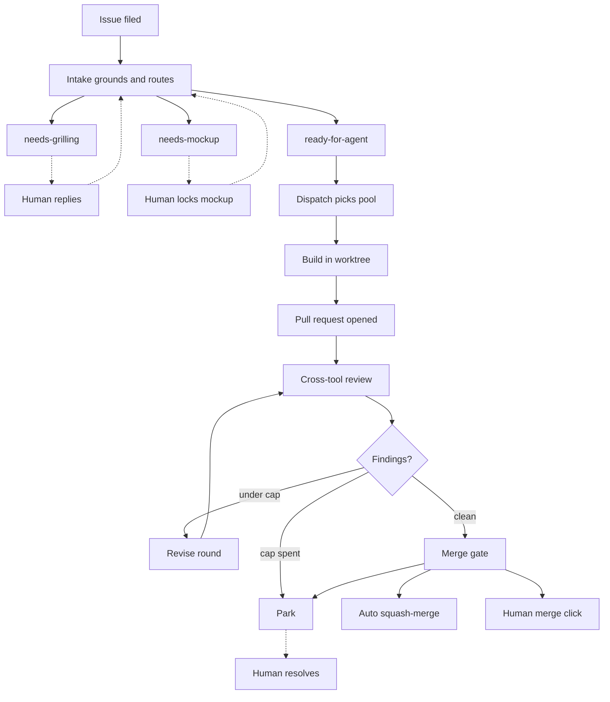
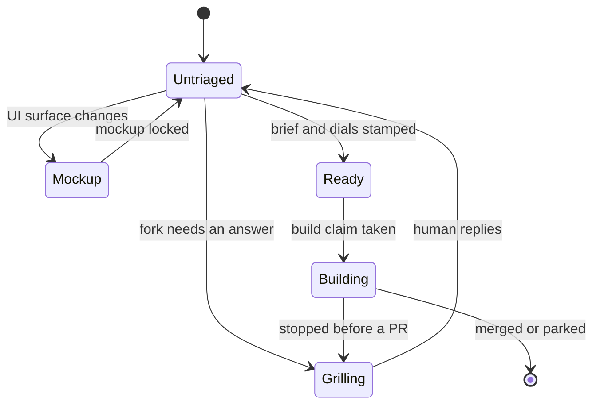
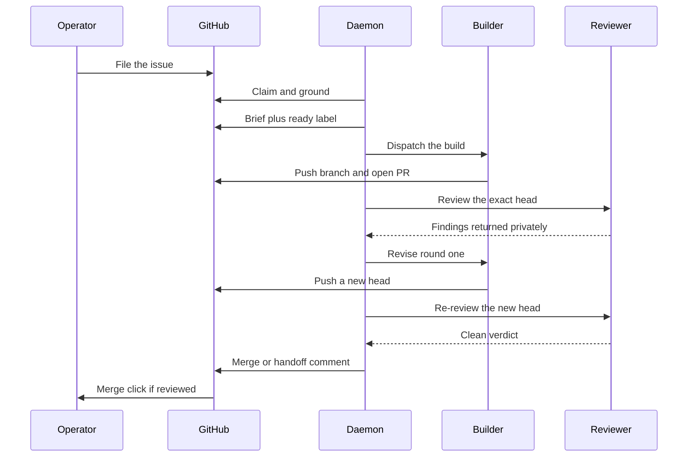
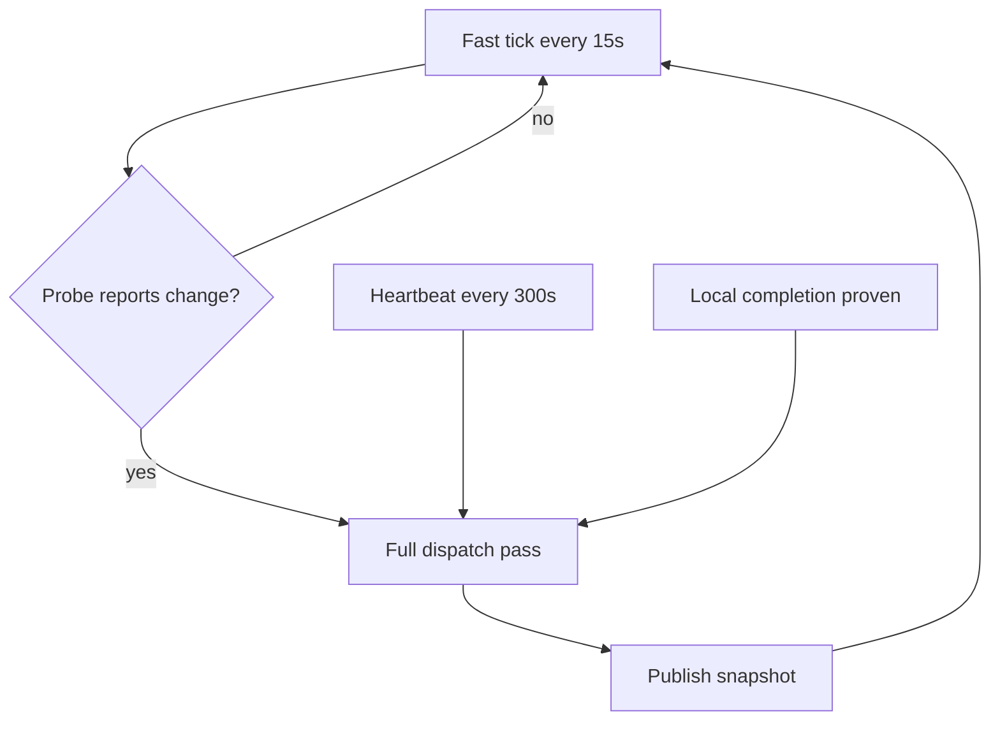
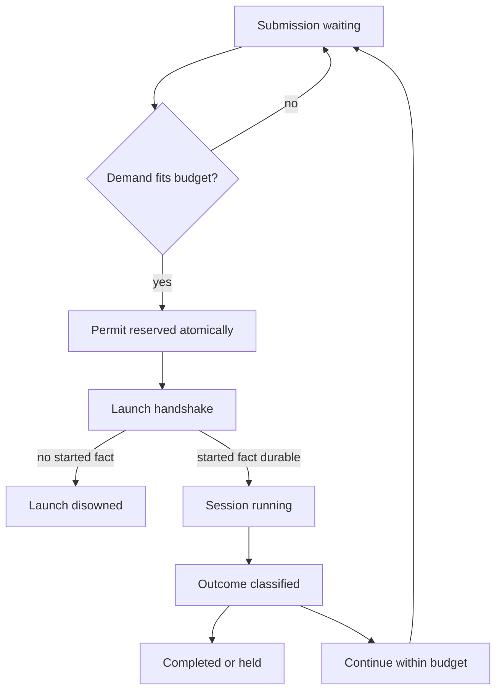
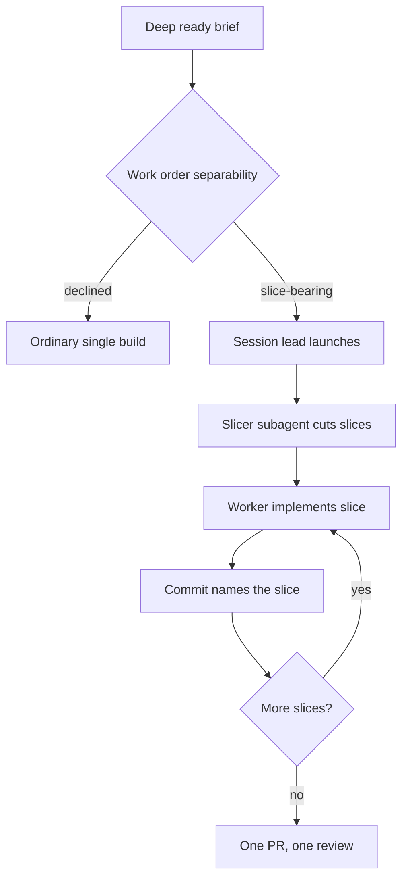
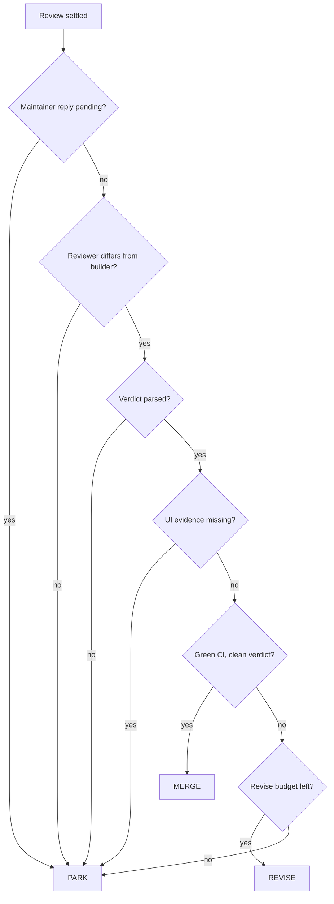

# How AgentFlow works

AgentFlow is an unattended GitHub issue → pull request engine for one operator. It
grounds an approved issue against the real code, builds it in an isolated worktree,
reviews the exact commit that was pushed, and applies the repository's merge policy.
GitHub and the repository stay the durable authority throughout; AgentFlow executes
ordinary build issues and does not own planning conversations, issue tracking, or
repository decisions.

!!! note "How to read this page"
    **Part 1 — The operator's view** is for anyone who files work and watches it land.
    It covers what a Build Issue is, how intake routes it, what the labels mean, how
    autonomy profiles change the ending, and exactly where a human is required.

    **Part 2 — The engine** is for anyone who wants to know why it behaves that way:
    the daemon's clocks, the coordinator's permits and budgets, slicing, build
    isolation, review machinery, the merge gate, and persistence.

    You can stop after Part 1 and still operate the system correctly.

## The 60-second version

Everything below is an expansion of one path. An issue is filed with no state label.
Intake grounds it against the code, rewrites it into something specific, and routes it
to exactly one of three outcomes. Only one of those three routes is buildable; the other
two are holds that wait for a human. A buildable issue is dispatched to whichever
provider pool has headroom, built in its own worktree, and opened as a pull request. The
*other* tool reviews the exact pushed commit. Findings become bounded revise rounds. A
pure gate then decides merge, revise, or park.



The dotted edges are the human-touch branches. Every one of them is a deliberate stop:
the engine has reached a point where a machine answer would be a guess, so it writes
down what it knows and waits. The solid path from `ready-for-agent` to a merge or a
handoff comment runs unattended.

---

## Part 1 — The operator's view

### Filing work

The unit of work is a **Build Issue**: one operator-approved, independently buildable
GitHub issue that enters intake. That definition is doing real work. "Independently
buildable" means the issue can be finished without waiting on a decision that has not
been made yet. "Operator-approved" means the decision to do this work has already
happened, outside the engine.

This is the planning/execution boundary, and it is the product's central promise.
Uncertainty is explored upstream, in a chat session, under the
[Wayfinder](https://github.com/ConnorGriffin/agentflow/blob/main/docs/adr/0027-wayfinder-planning-boundary.md)
boundary:

```text
uncertainty → Wayfinder decision map → clear Build Issue → AgentFlow pipeline
```

Wayfinder never executes. When planning turns up a world-changing prerequisite, that
prerequisite becomes its own ordinary Build Issue. Issues handed off this way carry
their resolved decisions in the body and deliberately do **not** carry a `wayfinder:*`
label, so normal intake picks them up and grounds them like anything else.

!!! important "There is no second approval inside AgentFlow"
    Once an issue is filed, no further human confirmation is solicited before work
    starts. The approval happened when the issue was written. A proposal to stamp
    handed-off tickets `ready-for-agent` directly was
    [rejected](https://github.com/ConnorGriffin/agentflow/blob/main/docs/adr/0027-wayfinder-planning-boundary.md):
    it would bypass grounding, the Agent Brief, and the dials — the three things that
    make an issue safe to build unattended.

### Intake and the three routes

Intake fires on every open issue that has no state label, excluding `wayfinder:*`
planning artifacts. It does three things in order
([ADR 0016](https://github.com/ConnorGriffin/agentflow/blob/main/docs/adr/0016-intake-stage.md)):

**Ground.** *Grounding* means re-deriving the issue's claims against the actual code
rather than trusting the prose. The intake session reads deeply, and may pull a fresh
read-only snapshot of real data to check that the numbers in the issue are the numbers
in the system. An issue whose premise turns out to be false does not become a build.

**Rewrite.** The title and description are made specific. The original title is
preserved in the body as `> Retitled from: "…"`, and the issue as filed is kept under a
collapsed details block. Nothing the human wrote is destroyed; it is demoted.

**Route.** Exactly one of three mutually exclusive state labels is applied.

| Route | What it means |
|---|---|
| `ready-for-agent` | Build-ready. Brief written, dials stamped. |
| `agentflow:needs-grilling` | A real, outcome-changing fork intake cannot settle. |
| `agentflow:needs-mockup` | A user-facing surface beyond a minor bugfix. |

The grilling route is not "intake got confused." It is reserved for a fork where two
defensible answers produce genuinely different software. The mockup route holds work
that would change a user-facing surface until a `/ui-craft lock` pass has fixed what
that surface should look like.

#### The Agent Brief

An issue routed `ready-for-agent` gets an **Agent Brief** written into its body. The
Brief is the single build input for every profile — not the original issue text, not a
chat transcript, not a plan file. It has fixed sections:

- **Summary** — what is being built.
- **Verified** — claims re-derived against named code and data, with real numbers.
- **Current behavior** and **Desired behavior**.
- **Key interfaces** and **Interface shape**.
- **Acceptance criteria** — checkboxes with grounded numeric literals and a regression test.
- **Out of scope** — what this build must not touch.

The acceptance criteria matter more than they look. Review is anchored to them
([ADR 0015](https://github.com/ConnorGriffin/agentflow/blob/main/docs/adr/0015-review-anchors-to-acceptance.md)),
so a criterion that is vague produces a review that is vague.

#### The two dials

Intake stamps two dials, and only ever on the ready route
([ADR 0018](https://github.com/ConnorGriffin/agentflow/blob/main/docs/adr/0018-two-dials-review-by-evidence.md)).
A **dial** is a label that sizes the work rather than describing it.

- `agentflow:complexity:standard|deep` — the model-size dial. This is a hard gate:
  no complexity label, no build. If two conflicting stamps end up on an issue, the more
  cautious one wins and it resolves to `deep`.
- `agentflow:effort:low|medium|high|extra` — how much room the work needs. Absent, it
  defaults to `medium`. This is guidance for ceilings and cost, not a hard gate.

#### Fail-safe parsing

Intake's output parser is deliberately asymmetric. Anything that is not confidently
`ready` or `mockup` becomes a hold — the grill route — never an accidental build. A
`ready` route arriving with a missing or invalid complexity dial is an explicit invalid
result; it is never silently upgraded to a default. Malformed output, missing dials, and
unreadable routes all converge on the same place: a human-visible hold.

The rule is that ambiguity holds. The engine would rather stop and ask than build the
wrong thing quietly.

### The label taxonomy

Every canonical label string lives in one module,
[`labels.py`](https://github.com/ConnorGriffin/agentflow/blob/main/agentflow/labels.py),
so a lane's claim is named the same way wherever it is taken, proved, or released.

| Label | Meaning |
|---|---|
| `ready-for-agent` | State: build-ready, brief and dials present |
| `agentflow:needs-grilling` | State: held for a human answer |
| `agentflow:needs-mockup` | State: held for a UI lock pass |
| `agentflow:complexity:standard` | Dial: standard model tier |
| `agentflow:complexity:deep` | Dial: deep model tier |
| `agentflow:effort:low` … `:extra` | Dial: how much room the work needs |
| `agentflow:mockup:local` / `:surface` | Dial: a parked mockup's reopening scope |
| `agentflow:triaging` | Claim: an intake session owns this issue |
| `agentflow:building` | Claim: an agent is building this issue |
| `agentflow:drawing-mockup` | Claim: a session is drawing variants |
| `wayfinder:resolving` | Claim: shared, human or daemon, on a planning ticket |
| `agentflow:ignore` | Opt-out: never admit this issue unattended |
| `wayfinder:research` | The one AFK-able planning ticket the daemon may run |
| `wayfinder:awaiting-disposition` | Research finished; needs an operator ruling |
| `wayfinder:parked` | Unattended research ended without an acceptable ruling |
| `wayfinder:grilling` / `:prototype` / `:task` | Planning types the daemon never dispatches |

Three groups behave differently:

**State labels** are intake-owned and mutually exclusive. The two held states are inert
to agents — no automated pass advances them. Only human re-entry does, via a plain
GitHub comment reply or `/agentflow pickup`
([ADR 0019](https://github.com/ConnorGriffin/agentflow/blob/main/docs/adr/0019-human-re-entry.md)).

**Claim labels** express lane ownership. A claim is applied *before* the owning session
runs and released once its outcome is durable. That ordering closes the window between
"this issue was selected" and "this issue has state" during which a second dispatch pass
could pick up the same work
([ADR 0021](https://github.com/ConnorGriffin/agentflow/blob/main/docs/adr/0021-dispatch-dedup-build-claim.md)).

**`agentflow:ignore`** is neither a pipeline state nor an ownership claim. It is an
operator veto: this issue is never admitted unattended, whatever else is true about it.

#### State-label transitions



The transition worth noticing is `Building → Grilling`. If a build stops before it has
produced a pull request, the issue is routed back to `needs-grilling` rather than left
sitting at `ready-for-agent`. Leaving it ready would mean the next dispatch pass tries
the same thing again with the same information; routing it to a hold puts the failure in
front of a human.

### Autonomy profiles

Every enrolled repository declares exactly one **autonomy profile** through a `profile:`
line in its `AGENTS.md` or `CLAUDE.md`. The profile is a single coupled dial that moves
grounding rigor, review requirements, and merge authority together
([ADR 0002](https://github.com/ConnorGriffin/agentflow/blob/main/docs/adr/0002-three-autonomy-levels.md)).

| Profile | Review and merge |
|---|---|
| `autonomous` | Cross-tool exact-head review; auto-merge on green CI and a clean untainted verdict |
| `reviewed` (default) | Cross-tool review when available, explicit same-tool fallback; a human glances and merges |
| `guarded` | Mandatory real-data or running-app grounding; dual or human review; a human always merges |

What sets the profile is **domain risk** — the cost of a plausible-looking wrong merge —
and nothing else
([ADR 0001](https://github.com/ConnorGriffin/agentflow/blob/main/docs/adr/0001-per-repo-autonomy-profile.md)).
Not which tool is doing the work, not how mechanical the change looks, not how confident
the last few builds were. A one-line change to a payments path is high-risk; a
sprawling refactor of a toy is not.

The enforcement is mechanical rather than advisory. In `coordinated_review.py`, the
merge branch is gated on `profile == "autonomous"`. A non-autonomous repository reaches
a different branch entirely: post the clean-review summary, hand off to the human, stop.
`squash_merge` is not something a `reviewed` repository declines to call — it is
something a `reviewed` repository never reaches.

#### The trust ratchet

Repositories loosen toward autonomy only as staged decisions are consistently confirmed
([ADR 0007](https://github.com/ConnorGriffin/agentflow/blob/main/docs/adr/0007-decisive-intake-graduated-autonomy.md)).
The ratchet is deliberate, reversible, and per-repository. It is never a default and
never automatic; nothing in the engine promotes a repository on its own.

!!! note "AgentFlow runs `reviewed` on itself"
    This repository is enrolled in its own fleet, and its profile is `reviewed`. The
    reason is written in its `AGENTS.md`: changes to the merge machinery are
    correctness-sensitive, so a human merges changes to the thing that decides merges.
    The engine is not trusted to auto-merge changes to its own trust boundary.

### Where a human intersects

The complete list of points where the pipeline requires or invites a person:

1. **Enrollment and profile choice.** `agentflow enroll <path> --profile <profile>`.
   The choice of `autonomous`, `reviewed`, or `guarded` is a human judgment about domain
   risk. Enrollment is dry-run by default and requires `--apply`.
2. **Activation.** The daemon starts paused. `agentflow resume` is what permits cold
   submissions to start.
3. **Grilling replies.** An issue at `agentflow:needs-grilling` advances when a human
   answers the question in a plain GitHub comment, or drives it live with
   `/agentflow pickup <N>`.
4. **Mockup locks.** An issue at `agentflow:needs-mockup` is resolved only by a human
   `/ui-craft lock` session. No automated pass clears it.
5. **The merge click.** On `reviewed` and `guarded`, the human's only act is a glance
   and a merge click. `guarded` requires it unconditionally
   ([ADR 0017](https://github.com/ConnorGriffin/agentflow/blob/main/docs/adr/0017-guarded-auto-scope-human-merge.md)).
6. **Park resolution.** A park is a structured handoff addressed to a person; it does
   not clear itself.
7. **The unanswered-comment gate.** An unanswered maintainer comment on a PR blocks
   auto-merge outright. An open question from the person who merges means a reply, not a
   merge, is the next move.
8. **Forcing a same-tool review.** `/agentflow review <pr>` will run a review with the
   same tool that authored the change, after a warning and an explicit confirmation. The
   PR is then permanently **tainted** — human-merge-only — until the other tool cleanly
   reviews the exact head, which clears the taint automatically.
9. **Wayfinder dispositions.** Every closed research ticket needs a human ruling. The
   daemon never chooses among candidates.
10. **`agentflow:ignore`.** The unconditional opt-out.
11. **The console.** Read-only by construction; see below.

Interactive verbs — `enroll`, `pickup`, `triage`, `scope`, `build`, `review`, `revise` —
run exactly the same logic the daemon runs. Manual entry adds convenience, never
authority: safety gates are not skippable by driving a stage by hand
([ADR 0019](https://github.com/ConnorGriffin/agentflow/blob/main/docs/adr/0019-human-re-entry.md)).

### Timeline of a typical issue

The happy path with one revise round, as the five participants that matter see it.



Step by step, including where the branches fork off:

1. **Filed.** The operator, or a Wayfinder handoff, files an ordinary issue with no
   state label.
2. **Intake claim.** `agentflow:triaging` is applied before any grounding happens.
3. **Grounding.** The intake session reads the code, optionally pulls read-only real
   data, and verifies the premise.
4. **Route decided.** Ready, grill, or mockup. The triaging claim is released.
   *If held:* the issue stops here until a human replies or runs `/agentflow pickup`;
   the daemon re-checks on comment activity.
5. **Build claim and dispatch.** `agentflow:building` is applied, and a provider pool
   with headroom is chosen.
6. **Build.** An isolated worktree, the Brief as the only input, a pull request on a
   branch named `agentflow/<tool>/issue-N-*`.
7. **Review.** The cross-tool reviewer inspects the exact pushed head at an assigned
   depth, and may ship a clear fix itself.
8. **Revise.** Up to two logical revise rounds. *If exhausted:* park.
9. **Gate decision.** The pure `decide_merge` check runs: reply pending, reviewer
   independence, parsed verdict, UI evidence, CI green, clean verdict.
10. **Outcome.** On `autonomous` and clean, a squash-merge and released labels. On
    `reviewed` or `guarded`, a clean-review summary comment and a waiting merge click.
    On anything unresolved or exhausted, a two-section park comment.
    *If parked:* the operator resolves it on GitHub or with `/agentflow revise <PR>`.
11. **Merge lands.** Merges are serialized fleet-wide, so two pull requests never
    squash-merge at the same instant.

Recovery runs underneath all of this. A crash or interruption resumes from durable
coordinator records rather than replaying from the top, and restarts never duplicate
comments, labels, issues, attempts, or claims.

### When things stop

A **park** is a deliberate, durable stop with a written handoff. Every park comment has
exactly two sections:

- **Maintainer decision needed** — the behavior in question, the options, the
  consequences of each, and a recommendation.
- **Agent handoff** — code locations, conflicting changes, check results, what work was
  retained, and the exact next action.

Only final outcomes are public. Intermediate review findings stay private, so the issue
thread does not fill with a machine arguing with itself.

The main causes of a park:

- **Revise exhaustion** — two unproductive revise rounds.
- **Recovery exhaustion** — the attempt or continuation budget is spent with no new
  state to work from.
- **Review disagreement** — a reviewer-fix and re-review chain that keeps changing the
  code parks after three consecutive change-making passes.
- **Missing UI evidence** — a declared UI surface changed with no screenshot. This gate
  is mechanical and unwaivable; a reviewer who waves it through cannot clear it.
- **A red check on the reviewed commit** — an `action_required` check parks immediately.
- **Merge failure** — a failed squash-merge parks with the explicit reason. There is no
  blind retry.
- **Conflict-resolution failure** — two genuinely competing product intents.
- **Research exhaustion** — an unattended research run that ended without a ruling the
  contract accepts gets one durable park comment naming the refusing check, plus
  `wayfinder:parked`, which takes it permanently out of unattended selection.

One case that deliberately does *not* park: if the cross-tool reviewer is unavailable,
an autonomous pull request holds open indefinitely without consuming capacity. It
neither fails nor parks — it waits for the other tool to become available.

!!! note "Pause is not drain"
    `agentflow pause` stops cold submissions, but heartbeats keep observing and
    finalizing existing work. A drain is complete only when no non-retired record is
    waiting or running. Killing the process is not a drain.

### The console

The console is a read-only projection. It has no mutation path into the pipeline; every
actionable state deep-links out to GitHub, a chat session, or the CLI
([ADR 0035](https://github.com/ConnorGriffin/agentflow/blob/main/docs/adr/0035-workflow-engine-read-only-operator-console.md)).

It shows a fleet home — exceptions, live sessions, capacity, recent landed changes — and
a per-repository view with decision maps, build issues, blockers, and landed evidence.
Its pages are Inbox, Live, Fleet, History, Workspace, and Briefing. It binds to loopback
and runs under its own service, so pausing dispatch does not stop the console.

The important architectural fact is that the web server never queries GitHub. The daemon
produces a snapshot every cycle — including while dormant, because dormant is exactly
when the operator is watching — and writes it atomically to a state file. The server
reads that file
([ADR 0026](https://github.com/ConnorGriffin/agentflow/blob/main/docs/adr/0026-daemon-owned-snapshot.md)).
Freshness is reported honestly rather than enforced: if the daemon is down, the last
snapshot is served with its real age attached, and a missing file reads as an empty
fleet rather than an error.

---

## Part 2 — The engine

### The daemon

The daemon runs two clocks
([`daemon.py`](https://github.com/ConnorGriffin/agentflow/blob/main/agentflow/daemon.py)).

A **fast tick** every 15 seconds asks one cheap cross-fleet question through a
`ChangeProbe` — a single API call for the whole fleet. It triggers a full dispatch pass
only on three signals: the probe reports change, a local completion is proven, or the
heartbeat is due. A **heartbeat** every 300 seconds runs a full pass unconditionally, as
the backstop for whatever the probe misses — GitHub's search index lags, and the
heartbeat is what makes that lag survivable rather than fatal. The full pass runs in a
background thread under a single-flight lock, so the fast tick never blocks behind it.



Three properties round it out:

**Dormant by default.** An enable-flag file controls whether the daemon does anything.
Absent that flag, there are zero network calls between heartbeats.

**Single-instance lock.** A lock directory stamped with the owner's pid, heartbeated
every 60 seconds, is reclaimed only if it is stale past three hours or the pid is
provably dead. Two daemons never race.

**Local-completion wake.** A network-free process sweep over running records wakes a
full pass the moment a provider family is proven dead, so a finished session does not
wait out the heartbeat. It fails closed: unknown liveness is treated as alive.

The daemon wires together a small set of modules, each with one job: `dispatch.py`
discovers stage inputs and submits durable submissions but never starts a provider;
`coordinator/` owns records, budgets, and admission; `balancer.py` picks the
builder/reviewer pair; `routing.py` holds the capability ladder; `runner.py` handles
worktrees and preflight; `live.py` writes the atomic projections the console reads; and
`webapp.py` serves them.

### The coordinator

The coordinator's charter is one sentence: **one owner for one logical stage session**
([ADR 0030](https://github.com/ConnorGriffin/agentflow/blob/main/docs/adr/0030-session-coordinator-seam.md)).
It owns continuation records, the waiting queue, attempt budgets, the admission matrix,
atomic permit reservation, the crash-safe provider start handshake, outcome-first
classification, and reconciliation.

#### The store

State lives in a private, versioned SQLite database at
`~/.agentflow/coordinator/records.db`. Permit-ledger writes happen under a single
`BEGIN IMMEDIATE` transaction, which is what makes it impossible for two coordinators to
over-reserve the same pool. The journal mode is deliberately not WAL: WAL would violate
a byte-identity invariant the refused-operations records depend on, and it is hostile to
read-only readers.

Concurrency is handled with a per-process lock on the shared connection plus a busy
timeout defaulting to 2000 ms. Past that timeout the store fails closed rather than
blocking a cycle — a stalled write is preferable to a stalled daemon.

#### Permits and budgets

A **permit** is a unit of durable pool capacity. A session reserves its entire demand
atomically or not at all.

| Constant | Value |
|---|---|
| `PERMIT_BUDGET` (per pool) | 5 |
| `ATTEMPT_BUDGET` (per stage) | 3 |
| `RESTART_RESUME_CAP` | 5 |
| `REPAIR_BUDGET` | 1 |
| `MACHINE_CEILING` (concurrent root sessions) | 4 |
| Per-stage caps | triage 3, build 2, mockup/respond/research 1 |

The **admission matrix** is a static table of permit demand per
`(stage, pool, model, complexity, effort)`
([ADR 0029](https://github.com/ConnorGriffin/agentflow/blob/main/docs/adr/0029-static-per-pool-admission.md)).
It is a table rather than a heuristic on purpose: capacity decisions are reproducible and
testable. A Claude deep review costs 1 permit; the same review on Codex costs 2. Revise
costs 3 to 5. Build scales from 3 to 5 with the effort dial. A known pool row that is
missing falls back to the full pool budget — that is, an unpriced session takes the pool
exclusively rather than being guessed at.

`ATTEMPT_BUDGET = 3` means one initial launch plus at most two continuations per stage.
`RESTART_RESUME_CAP = 5` allows sessions killed by a daemon restart to resume without
being charged an attempt, but only five consecutive times before parking.
`REPAIR_BUDGET = 1` gives a clean exit that is missing a required outcome exactly one
targeted repair turn — and a malformed verdict earns one contract-repair turn rather
than an entire re-review.

#### Scheduling

PR-bound stages (review, revise, respond) drain ahead of issue-bound stages (build,
mockup, intake) on the same pool
([ADR 0039](https://github.com/ConnorGriffin/agentflow/blob/main/docs/adr/0039-open-prs-drain-first.md)).
Getting an open pull request over the finish line outranks starting a new one, and the
tier is a pure function of the stage name rather than per-record state. Without this, a
single high-effort build could seize a whole pool and starve the review that would have
let it merge.

Code-writing stages are pinned to their tool lineage across continuations; review becomes
lineage-pinned once launched. And merges are serialized fleet-wide by a single
process-wide lock, so concurrent dispatch multiplies builds without ever multiplying
overlapping merges
([ADR 0009](https://github.com/ConnorGriffin/agentflow/blob/main/docs/adr/0009-collision-safety.md)).

#### A submission's path



Reservation validates the waiting record inside the immediate transaction, sums demand
over the pool's running rows, and refuses if the total would exceed the budget. Durable
running rows are the only permit ledger; there is no separate counter that could drift.

### Dispatch, providers, and the capability ladder

Two provider pools exist: Claude and Codex. The **balancer** sends the builder to
whichever pool has more rate-limit headroom, and the reviewer is *always* the other tool
([ADR 0006](https://github.com/ConnorGriffin/agentflow/blob/main/docs/adr/0006-two-pool-runner-assignment.md)).
Cross-tool independence is not an option the balancer weighs; it is the constraint the
balancer optimizes under.

Claude dispatch authority comes from the provider's own five-hour quota reading plus a
paced seven-day allowance — the coordinator persists the provider's own numbers rather
than estimating them, and validates them fail-closed. An activity-adaptive ceiling
throttles a pool the operator is personally using, and an operator "floodgates" valve can
lift the weekly pace when a burst is wanted
([ADR 0025](https://github.com/ConnorGriffin/agentflow/blob/main/docs/adr/0025-activity-adaptive-spend-ceiling.md)).

#### Session leads

Every Build and Revise launches a **session lead** — Claude/Fable or Codex/Sol — at low
reasoning effort
([ADR 498](https://github.com/ConnorGriffin/agentflow/blob/main/docs/adr/adr-498-capability-routed-session-led-dispatch.md)).
A session lead is an orchestrator that never writes code itself. It delegates down a
**capability ladder**: a provenance-stamped mapping of named models to provider CLI
identifiers, with recorded benchmark dates and prices, and per-area escalation ladders
for exploration, implementation, and review.

Escalation is bounded and explicit. The lead retries the same rung once after a failed
verification, escalates exactly one rung, and at the top of the ladder hands off both
failures rather than looping. Nothing in that path can silently spend its way upward.

### Slicing

**Slicing** is decomposing one Build or Revise into independently verifiable, file-level
chunks — *slices* — each implemented by a fresh in-session subagent worker of the
accountable session lead, all landing on one pull request as a commit per slice.

It starts at intake. A `deep`-complexity ready brief may carry a `## Work order` section
that judges separability: either `slice-bearing`, with domain facts, fixtures, and named
invariant tests, or `declined`, with a stated reason the work is indivisible
([ADR 465](https://github.com/ConnorGriffin/agentflow/blob/main/docs/adr/adr-465-work-order-is-the-non-self-scoping-brief.md)).
Intake deliberately never names the file-level slices. Those are cut fresh by an
in-session **Slicer** subagent that reads the actual checkout, because a slice list
written before anyone looked at the code is a guess.



A finished slice hands back exactly four things: a one-line summary, its commit, a
named-invariant-test pass or fail, and bounded unresolved concerns. Never a transcript,
never a diff
([ADR 468](https://github.com/ConnorGriffin/agentflow/blob/main/docs/adr/adr-468-slice-ledger-and-revert-condition.md)).
The rule that keeps this honest is that **the per-slice commits are the only ledger**. No
parallel record is kept, because a second record of what happened is a second thing that
can be wrong.

??? info "Why slices run in-session rather than as launched sessions"
    The obvious design is to launch each slice as its own coordinator session. The
    permit math forbids it. A deep build already reserves four or five of a pool's five
    permits; a coordinator plus one launched slice would need seven permits on a
    five-permit pool. Admitting that would mean either raising the budget or letting
    slices starve everything else.

    The cost model closes the argument. Measured session cost is essentially linear in
    turns — `$ = 0.063 × turns^0.99`, flat at about $0.060 per turn from 20 to 160 turns
    — so running slices concurrently saves nothing. The savings come from the *tier
    premium*: cheap workers doing work an expensive model would otherwise do. That
    saving is available in-session
    ([ADR 464](https://github.com/ConnorGriffin/agentflow/blob/main/docs/adr/adr-464-slice-runs-in-session.md)).

    Since every Build and Revise now runs under a session lead, the lead simply *is* the
    coordinator for its slices, and slice model choice uses the same capability ladder
    as everything else
    ([ADR 511](https://github.com/ConnorGriffin/agentflow/blob/main/docs/adr/adr-511-slicing-survives-under-the-session-lead.md)).

### Build isolation

#### Worktrees

Build, Revise, Respond, and Mockup all get a git worktree through one shared path. Three
rules govern it:

- **Reuse as-is.** A retained worktree is reused exactly as it was left, never rebuilt.
  Rebuilding would discard the state a continuation exists to continue from.
- **Refuse by name.** Any git failure refuses the submission by name, and consumes no
  permit and no attempt. A stage that could not get a workspace has not attempted
  anything.
- **Disposable marking.** New worktrees are marked disposable so retention can reclaim
  them later. A Build with no existing worktree may start a fresh branch from
  `origin/main`; continuation stages only ever recover an existing branch.

#### The launch handshake

Starting a provider is the point where a crash does the most damage, so the handshake is
explicit
([`coordinator/launcher.py`](https://github.com/ConnorGriffin/agentflow/blob/main/agentflow/coordinator/launcher.py)).
The coordinator forks a launch child carrying the store path, the record identity, a
**launch token**, the session timeout, an optional build lease, and a worktree pointer.
The intermediate process exits at once. The provider grandchild claims a durable
`started` fact under the launch token — recording its supervisor pid and provider group
id — *before* any provider code runs. The launcher polls up to 10 seconds for that fact;
if it never appears, the token is atomically disowned, so no provider that was never
counted against a permit can start.

#### Ceilings and allowlists

Each session gets a launch envelope keyed on stage, complexity, and effort: a wall-clock
ceiling, a turn ceiling, a reasoning-effort rung, and a tool allowlist
([ADR 0044](https://github.com/ConnorGriffin/agentflow/blob/main/docs/adr/0044-stage-session-profiles-and-ceilings.md)).
Read-only stages — intake, research, attack — get read and search tools only, with edit
tools mechanically withheld rather than merely discouraged. Intake runs 20 minutes and
80 turns; review 30 minutes and 120; mockup 60 minutes and 200. Review deliberately keeps
the full edit surface, because its contract includes shipping bounded fixes.

#### The progress lease

Build alone uses a **progress lease** instead of a fixed wall
([ADR 570](https://github.com/ConnorGriffin/agentflow/blob/main/docs/adr/adr-570-build-progress-lease.md)).
The detached supervisor renews a short silent-inactivity deadline only when it observes
durable progress: a new branch HEAD, a completed edit action, a recognized passing test,
or new durable worktree state. A standard build gets 15 minutes of silence, 45 minutes of
test grace, and a 2-hour absolute cap. Deep at medium or high effort gets 20/60/3h; deep
at extra effort gets 30/75/4h. A build that is genuinely working keeps its lease; a build
that has gone quiet is killed quickly, and neither outcome depends on guessing a single
number up front.

#### Retention

Worktrees are reclaimed by idle age first — 24 hours — and then by count, with a cap of
12 retained per repository and at most 20 archived per sweep
([ADR 0050](https://github.com/ConnorGriffin/agentflow/blob/main/docs/adr/0050-bounded-worktree-retention.md)).
Before a stranded session is reclaimed, its full working-tree state is snapshotted into a
commit under `refs/agentflow/stranded/<name>/<sha12>`, so nothing is deleted without
being recoverable. Sweeps run hourly per repository inside the dispatch pass, and never
while paused.

There is also a hard dispatch ceiling: above a threshold of registered worktrees, a
repository stops receiving new cold work.

??? info "The outage that produced the ceiling — and the one that recalibrated it"
    The Claude CLI embeds a sandbox profile in the argv of every shell it spawns, adding
    three filesystem deny paths per linked worktree, and the whole command line must fit
    under the OS exec-argument limit. Enough registered worktrees and every shell command
    in every session in that repository fails to spawn.

    That happened. Roughly 246 registrations blew past a measured ~1.6 MB argv and every
    session in the repository lost its shell. Worse, all four failed attempts were
    recorded as "continuation budget exhausted" — true, and completely misleading about
    the cause. `WORKTREE_DISPATCH_CEILING` was set to 175 on the strength of that
    measurement.

    A second incident on 2026-07-31 killed three more sessions, and this time the
    provider transcripts carried the CLI's own spawn diagnostic. Measured against that
    evidence, the cliff on the current CLI sat at roughly 50 registrations, not 246 —
    the two dead builds hit it at 52 and 51 linked worktrees with about 1.1 MB of spawn
    argv. The per-registration cost moves with CLI version and path length, so the
    original calibration had simply rotted.

    [ADR 442](https://github.com/ConnorGriffin/agentflow/blob/main/docs/adr/adr-442-dispatch-ceiling-below-the-measured-argv-cliff.md)
    dropped the ceiling from 175 to **40** — about 12 registrations below the observed
    death point, with the margin sized to the intra-hour growth the incident actually
    showed. Work over the ceiling now defers and retries after sweeps shrink the
    registry, instead of launching sessions that die on their first command.

    The honest caveat is recorded in the code: this is a count standing in for a byte
    limit, and it does not port across machines. Re-measure before trusting it elsewhere.

### Review machinery

#### Exact-head review

A review is bound to a commit, not to a branch
([ADR 0028](https://github.com/ConnorGriffin/agentflow/blob/main/docs/adr/0028-stage-scoped-continuations.md)).
The parsed verdict names the exact starting head and the exact final head reviewed after
any bounded fixes the reviewer shipped. Verification checks the verdict against the
record's target, review depth, review axis, and change-author tool, and rejects any
review whose session used the retired GitHub follow-up-issue-creation action.

Review depth is Focused, Targeted, or Full. It is proposed by the change author with a
stated reason, and a later reviewer may only ever escalate it — never downgrade
([ADR 0047](https://github.com/ConnorGriffin/agentflow/blob/main/docs/adr/0047-reviewers-ship-clear-fixes.md)).
Findings take one of four actions: `fix_before_completion`, `necessary_follow_up`,
`ask_maintainer`, or `discard_preference`.

Reviewers may ship a clear fix themselves rather than bouncing a trivial miss back. When
they do, the other tool must then inspect the *new* exact head. No reviewer ever approves
its own changed head.

#### The head-check gate

> A review may not finish clean while the exact reviewed commit has a red check.

That rule is decided from GitHub at settlement time, not from the verdict text
([ADR 417](https://github.com/ConnorGriffin/agentflow/blob/main/docs/adr/adr-417-head-check-gate.md)).
The distinction is the whole point: a reviewer cannot clear a red check by not looking at
it. A red check opens a revise round from the same two-round cap; an `action_required`
check parks immediately. The gate exists because a review was once posted clean 23
minutes after its head had gone red.

#### Independence

The reviewer's model must differ from the current change author's model, keyed to the
exact-head author fact rather than to the branch lane
([ADR 0003](https://github.com/ConnorGriffin/agentflow/blob/main/docs/adr/0003-cross-tool-review.md)).
Whoever last touched this commit is the fact that matters, not who opened the branch.

Session leads weakened this deliberately: a lead's own delegated worker may still be
reviewed by that same tool, on the reasoning that the reviewing model is genuinely
different from the worker model even when the provider is the same
([ADR 498](https://github.com/ConnorGriffin/agentflow/blob/main/docs/adr/adr-498-tiered-parent-independent-review.md)).

#### Anchoring and bounds

Reviews judge against the Brief's stated acceptance criteria, not an unbounded
correctness bar. Blocking is reserved for a real bug or security hole that breaks a
stated criterion, or a charter violation
([ADR 0015](https://github.com/ConnorGriffin/agentflow/blob/main/docs/adr/0015-review-anchors-to-acceptance.md)).
This is what stops review from becoming an infinite improvement loop.

`MAX_REVISES = 2` logical rounds. Continuation attempts inside a round never reset or
expand that cap — the per-stage attempt budget and the product-level round cap are
separate ledgers. Conflict revises, where a survivor pull request has to be rebased
through conflicts, are counted apart and never spend the round cap; each conflicting head
gets its own bounded stage
([ADR 0038](https://github.com/ConnorGriffin/agentflow/blob/main/docs/adr/0038-conflict-resolution-as-revise.md)).

#### Taint

A **taint** is a durable mark that a pull request's review was not independent. Forcing a
same-tool review makes the PR permanently human-merge-only. It clears automatically —
and only — when the other tool cleanly reviews the exact head.

### The merge gate

`decide_merge` is a pure function
([`gate.py`](https://github.com/ConnorGriffin/agentflow/blob/main/agentflow/gate.py)),
which is what makes the merge policy testable without touching GitHub.



Note which failures park rather than revise. An unparsed verdict parks, because a builder
revise cannot fix a review that failed to produce a usable verdict. A missing screenshot
parks, because the builder was already told to attach one and churning revises will not
change that. Only a fixable miss with budget remaining becomes a revise.

The UI-evidence check is decided from the diff and the pull request's attachments, never
from the verdict, so a reviewer who discards a screenshot-less UI change cannot clear it.

The profile decides whether `MERGE` is even reachable. In `_settle_review`, a
non-autonomous repository takes a branch that runs the head-check gate, posts the
clean-review summary, and finishes — it never calls `decide_merge` or `squash_merge` at
all. Unresolved review actions there park with an explicit reason naming the profile.
Only the autonomous branch continues into taint checks, the cross-tool-review proof, the
head-check and CI gates, `decide_merge`, and finally a squash-merge under the merge lock.
The UI-evidence and head-check gates apply regardless of profile.

### State and persistence

The split of authority is explicit: **GitHub owns** issues, pull requests, branch state,
CI results, policy, and merge authority. **The coordinator owns** local claims, attempts,
permits, recovery, and state transitions.

Local state lives under `AGENTFLOW_STATE` (default `~/.agentflow`), and path construction
refuses escaping segments:

| Path | Contents |
|---|---|
| `coordinator/records.db` | Continuation store; the permit ledger authority |
| `coordinator/quota/` | Durable per-pool, per-window provider quota facts |
| `coordinator/sessions/` | Per-attempt provider event and result artifacts |
| `snapshot.json`, `live-sessions.json`, and peers | Atomically written console projections |

The projections carry a hard rule: **no production decision reads them.** They exist so a
human can see what is happening, and adding a decision that depends on them would turn a
display artifact into a control input.

??? info "Why the console reads a file instead of GitHub"
    The original dashboard queried GitHub itself, cached, and polled. On its first
    evening it exhausted the GitHub GraphQL quota of 5,000 points per hour — roughly
    8,600 queries per hour from a single dashboard, over the quota by itself — and
    starved the pipeline of the API budget it needed to actually work.

    The fix was to make the daemon the sole producer of the snapshot and the web server a
    pure file reader
    ([ADR 0026](https://github.com/ConnorGriffin/agentflow/blob/main/docs/adr/0026-daemon-owned-snapshot.md)).
    One snapshot production is about 36 GraphQL queries per daemon cycle, and — this is
    the property that mattered — that cost is constant regardless of how many watchers
    are open. The console cannot cost the pipeline anything.

    `POST /api/command` is a thin transport into the daemon's command channel, carrying
    an idempotency key and an expected aggregate revision. The web server never applies a
    domain transition itself.

### Tags, the other kind

Separately from GitHub labels, AgentFlow uses git release **tags** to pin the skill packs
its sessions run with
([ADR 0049](https://github.com/ConnorGriffin/agentflow/blob/main/docs/adr/0049-reproducible-repository-capabilities.md)).

`capabilities.toml` is the manifest of record. A skill pack is pinned by release tag *and*
the tag's peeled commit — for example tag `v0.3.0` alongside its exact commit — while
methodology skills are pinned directly to an exact commit with no tag at all. Per-file
SHA-256 hashes are pinned as well, and `skills-lock.json` mirrors each skill with its
source, source type, computed hash, and ref.

Enrollment resolves the tag with git and requires the peeled commit to equal the manifest
pin before installing anything. Then every tracked file in each required skill directory
is checked against a deterministic file list and its SHA-256. Only the skills a given
launch actually needs are materialized, and a native-discovery receipt — bound to the
provider executable's SHA-256 and the manifest's SHA-256 — is recorded per repository and
provider, proving the tools were actually discovered rather than merely present on disk.

!!! warning "Never move, retag, or delete a release tag"
    The pin is what makes a fleet's behavior reproducible. Moving a tag silently changes
    what every enrolled repository executes, without any diff appearing anywhere a human
    would look. The peeled-commit and per-file hash checks are what turn a moved tag into
    a loud failure instead of a quiet one — but the correct move is to cut a new tag and
    bump the pin deliberately.

### The learning pipeline

The learning pipeline is observational, and aggressively so:

```text
real terminal outcomes → observational report → human-reviewed methodology PR → later bounded observational cohort
```

`agentflow learning report` reads only terminal review and revise records plus per-attempt
telemetry, cohorts them by UTC date on their finalization time, and emits one
deterministic JSON document against a versioned schema. Missing telemetry is counted as
skipped and marks the report `degraded`; it is never coerced to zero. An unreadable or
old-schema store exits with an error and no JSON at all, rather than reporting on a
foundation it cannot verify.

The non-goals are the interesting part. The report has no provider, evaluation,
promotion, policy, admission, routing, safety, or canary action path. It makes no causal
claims and performs no automatic mutation. A human may read one report, propose a
methodology change through an ordinary reviewed pull request, then run a second bounded
report afterward — and that comparison remains observational, not causal. Nothing in this
path can change the engine on its own.

---

## Pitfalls and sharp edges

An honest list of the places where the design's costs are real.

**Bounded recovery is a hard stop, by design.** Three attempts and the work is durably
held for a human. That is the intended behavior, but it has a price: a red check on a
pull request can cost up to two builder sessions before it reaches the operator.
`RESTART_RESUME_CAP` at 5 and `REPAIR_BUDGET` at 1 are deliberately small for the same
reason — bounded churn beats unbounded churn — and the cost is that a genuinely transient
problem sometimes consumes the whole budget.

**Environment faults can still be misclassified as budget exhaustion.** In the worktree
outage described above, every session lost its shell for an environmental reason and the
failed attempts were all recorded as "continuation budget exhausted" — technically
accurate and diagnostically useless.
[ADR 386](https://github.com/ConnorGriffin/agentflow/blob/main/docs/adr/adr-386-dead-shell-environment-fault.md)
fixed this for Claude by detecting a dead shell through tool-use and tool-result
correlation and refunding the attempt as an environment fault. It explicitly did *not*
fix it for Codex: the Codex exec JSON surface carries no typed tool-result fact to
correlate a refusal back to a shell call. That is a known, documented, unaddressed gap.

**The lock-retry asymmetry.** `Store.upsert` was given a bounded retry on
"database is locked" — two delays before failing closed. The `_reserve` permit-reservation
path was not patched at the same time. A transient busy writer can therefore still fail a
reservation that a short retry would have won.

**The permit-default flip-flop.** The permit budget default was changed from 5 to 25,
which broke capacity-sensitive tests, then reverted to 5 with a runtime override. It was
a config-versus-code boundary bug, and it produced no ADR — the entire record is in commit
messages. A number that behaves like policy should be documented like policy.

**ADR-before-code drift.** In-session slicing, the commit-per-slice ledger, and
slice-bearing work orders were each described by an ADR before any implementation existed;
all three landed the same day, much later. The ADRs read as if the system already worked
that way. Reading the decisions without reading the git log can mislead you about what is
actually running.

**A cosmetic inconsistency in park comments.** A head that was green, then moved, then
came back red can show a stale "Outcome: clean." above a later park. The verdict is
correct; the leftover line is not.

**Cost misattribution across subagents.** The provider rolls subagent cost into the parent
session's total, and telemetry keyed on the routing dial once read a coordinated build as
fully deep while most of its turns ran on a cheap tier — silently wrong rather than
visibly missing, which is the worse failure mode. A per-model breakdown corrected it.

**The progress lease is Build-only.** Every non-Build stage, Revise included, still uses
the older fixed ceiling. A long but genuinely progressing Revise session can still be
killed by a coarse timeout that a lease would have renewed.

!!! note "An accepted failure, stated plainly"
    Universal per-issue file allow-lists for collision safety were rejected as "false
    safety." Instead the engine relies on merge-time rebase, CI, cross-tool overlap
    review, and serialized merges — which means it accepts an occasional doomed parallel
    build by design rather than pretending a static allow-list would have prevented it.

## Where it could go next

These are candidates that follow from the material above, not commitments on a roadmap.

- **Extend dead-shell detection to Codex.** The Claude path already refunds an
  environment fault instead of charging it against the continuation budget. Codex sessions
  keep the older classification because the exec JSON surface offers nothing to correlate.
  If that surface gains a typed tool-result fact, parity becomes straightforward.
- **Retry parity on the reservation path.** Giving `_reserve` the same bounded
  database-is-locked retry that `upsert` received would close the asymmetry, and the
  fail-closed behavior beyond the retry window would be unchanged.
- **A byte-based worktree ceiling.** The current gate counts registrations as a proxy for
  a byte limit whose slope moves with CLI version and path length. Measuring the actual
  spawn argv, or at least the per-registration slope on the running machine, would stop
  the number from rotting between recalibrations.
- **Progress leases beyond Build.** Revise is the obvious next candidate: it is a
  code-writing stage whose genuine work time varies as much as Build's, and it currently
  gets a fixed wall.
- **The deferred learning-pipeline stages.** Paired or synthetic provider evaluation,
  causal claims, automatic mutation, and slice-level attribution are all explicitly out of
  scope today and fail closed by omission. Any of them would need a human-governed
  promotion path before it could touch the engine.

## Further reading

- [Get started](getting-started.md) — requirements, install, enrollment, calibration,
  first run, and recovery.
- [Understand the pipeline](pipeline.md) — stages, authority, review, revise, merge, and
  recovery.
- [Repository capabilities](capabilities.md) — generated contracts, pins, and readiness.
- [Operate AgentFlow](coordinator-operations.md) — pause, drain, upgrade, diagnosis, and
  rollback.
- [Learning pipeline](learning-pipeline.md) — observed outcomes, human methodology review,
  and deferred evaluation.
