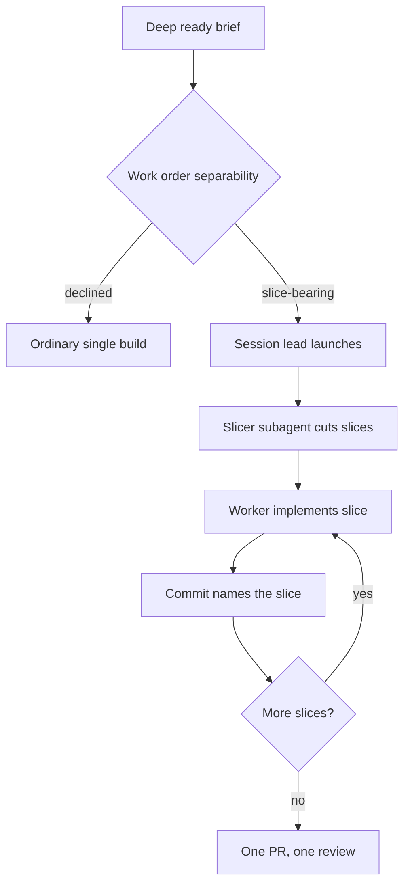
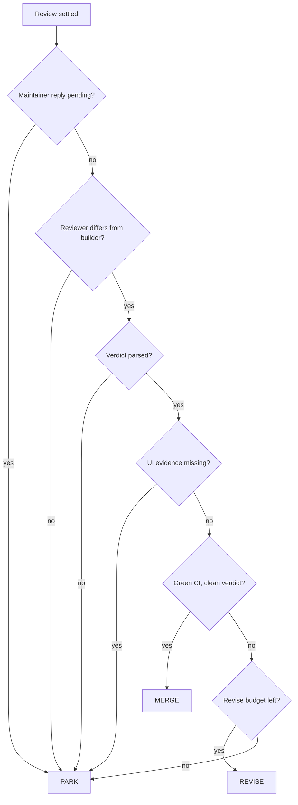

# Building and reviewing

*How a Build Issue becomes a pull request, and how that pull request earns a merge.*

## Slicing

**Slicing** is decomposing one Build or Revise into independently verifiable, file-level
chunks — *slices* — each implemented by a fresh in-session subagent worker of the
accountable session lead, all landing on one pull request as a commit per slice.

It starts at intake. A `deep`-complexity ready brief may carry a `## Work order` section
that judges separability: either `slice-bearing`, with domain facts, fixtures, and named
invariant tests, or `declined`, with a stated reason the work is indivisible
([ADR 465](https://github.com/ConnorGriffin/agentflow/blob/main/docs/adr/adr-465-work-order-is-the-non-self-scoping-brief.md)).
Intake deliberately never names the file-level slices. Those are cut fresh by an
in-session **Slicer** subagent that reads the actual checkout, because a slice list
written before anyone looked at the code is a guess.

A finished slice hands back exactly four things: a one-line summary, its commit, a
named-invariant-test pass or fail, and bounded unresolved concerns. Never a transcript,
never a diff
([ADR 468](https://github.com/ConnorGriffin/agentflow/blob/main/docs/adr/adr-468-slice-ledger-and-revert-condition.md)).
The rule that keeps this honest is that **the per-slice commits are the only ledger**. No
parallel record is kept, because a second record of what happened is a second thing that
can be wrong.

??? info "Why slices run in-session rather than as launched sessions"
    The obvious design is to launch each slice as its own coordinator session. The
    permit math forbids it. A deep build already reserves four or five of a pool's five
    permits; a coordinator plus one launched slice would need seven permits on a
    five-permit pool. Admitting that would mean either raising the budget or letting
    slices starve everything else.

    The cost model closes the argument. Measured session cost is essentially linear in
    turns — `$ = 0.063 × turns^0.99`, flat at about $0.060 per turn from 20 to 160 turns
    — so running slices concurrently saves nothing. The savings come from the *tier
    premium*: cheap workers doing work an expensive model would otherwise do. That
    saving is available in-session
    ([ADR 464](https://github.com/ConnorGriffin/agentflow/blob/main/docs/adr/adr-464-slice-runs-in-session.md)).

    Since every Build and Revise now runs under a session lead, the lead simply *is* the
    coordinator for its slices, and slice model choice uses the same capability ladder
    as everything else
    ([ADR 511](https://github.com/ConnorGriffin/agentflow/blob/main/docs/adr/adr-511-slicing-survives-under-the-session-lead.md)).

## Build isolation

### Worktrees

Build, Revise, Respond, and Mockup all get a git worktree through one shared path. Three
rules govern it:

- **Reuse as-is.** A retained worktree is reused exactly as it was left, never rebuilt.
  Rebuilding would discard the state a continuation exists to continue from.
- **Refuse by name.** Any git failure refuses the submission by name, and consumes no
  permit and no attempt. A stage that could not get a workspace has not attempted
  anything.
- **Disposable marking.** New worktrees are marked disposable so retention can reclaim
  them later. A Build with no existing worktree may start a fresh branch from
  `origin/main`; continuation stages only ever recover an existing branch.

### The launch handshake

Starting a provider is the point where a crash does the most damage, so the handshake is
explicit
([`coordinator/launcher.py`](https://github.com/ConnorGriffin/agentflow/blob/main/agentflow/coordinator/launcher.py)).
The coordinator forks a launch child carrying the store path, the record identity, a
**launch token**, the session timeout, an optional build lease, and a worktree pointer.
The intermediate process exits at once. The provider grandchild claims a durable
`started` fact under the launch token — recording its supervisor pid and provider group
id — *before* any provider code runs. The launcher polls up to 10 seconds for that fact;
if it never appears, the token is atomically disowned, so no provider that was never
counted against a permit can start.

### Ceilings and allowlists

Each session gets a launch envelope keyed on stage, complexity, and effort: a wall-clock
ceiling, a turn ceiling, a reasoning-effort rung, and a tool allowlist
([ADR 0044](https://github.com/ConnorGriffin/agentflow/blob/main/docs/adr/0044-stage-session-profiles-and-ceilings.md)).
Read-only stages — intake, research, attack — get read and search tools only, with edit
tools mechanically withheld rather than merely discouraged. Intake runs 20 minutes and
80 turns; review 30 minutes and 120; mockup 60 minutes and 200. Review deliberately keeps
the full edit surface, because its contract includes shipping bounded fixes.

### The progress lease

Build alone uses a **progress lease** instead of a fixed wall
([ADR 570](https://github.com/ConnorGriffin/agentflow/blob/main/docs/adr/adr-570-build-progress-lease.md)).
The detached supervisor renews a short silent-inactivity deadline only when it observes
durable progress: a new branch HEAD, a completed edit action, a recognized passing test,
or new durable worktree state. A standard build gets 15 minutes of silence, 45 minutes of
test grace, and a 2-hour absolute cap. Deep at medium or high effort gets 20/60/3h; deep
at extra effort gets 30/75/4h. A build that is genuinely working keeps its lease; a build
that has gone quiet is killed quickly, and neither outcome depends on guessing a single
number up front.

### Retention

Worktrees are reclaimed by idle age first — 24 hours — and then by count, with a cap of
12 retained per repository and at most 20 archived per sweep
([ADR 0050](https://github.com/ConnorGriffin/agentflow/blob/main/docs/adr/0050-bounded-worktree-retention.md)).
Before a stranded session is reclaimed, its full working-tree state is snapshotted into a
commit under `refs/agentflow/stranded/<name>/<sha12>`, so nothing is deleted without
being recoverable. Sweeps run hourly per repository inside the dispatch pass, and never
while paused.

There is also a hard dispatch ceiling: above a threshold of registered worktrees, a
repository stops receiving new cold work.

??? info "The outage that produced the ceiling — and the one that recalibrated it"
    The Claude CLI embeds a sandbox profile in the argv of every shell it spawns, adding
    three filesystem deny paths per linked worktree, and the whole command line must fit
    under the OS exec-argument limit. Enough registered worktrees and every shell command
    in every session in that repository fails to spawn.

    That happened. Roughly 246 registrations blew past a measured ~1.6 MB argv and every
    session in the repository lost its shell. Worse, all four failed attempts were
    recorded as "continuation budget exhausted" — true, and completely misleading about
    the cause. `WORKTREE_DISPATCH_CEILING` was set to 175 on the strength of that
    measurement.

    A second incident on 2026-07-31 killed three more sessions, and this time the
    provider transcripts carried the CLI's own spawn diagnostic. Measured against that
    evidence, the cliff on the current CLI sat at roughly 50 registrations, not 246 —
    the two dead builds hit it at 52 and 51 linked worktrees with about 1.1 MB of spawn
    argv. The per-registration cost moves with CLI version and path length, so the
    original calibration had simply rotted.

    [ADR 442](https://github.com/ConnorGriffin/agentflow/blob/main/docs/adr/adr-442-dispatch-ceiling-below-the-measured-argv-cliff.md)
    dropped the ceiling from 175 to **40** — about 12 registrations below the observed
    death point, with the margin sized to the intra-hour growth the incident actually
    showed. Work over the ceiling now defers and retries after sweeps shrink the
    registry, instead of launching sessions that die on their first command.

    The honest caveat is recorded in the code: this is a count standing in for a byte
    limit, and it does not port across machines. Re-measure before trusting it elsewhere.

## Review machinery

### Exact-head review

A review is bound to a commit, not to a branch
([ADR 0028](https://github.com/ConnorGriffin/agentflow/blob/main/docs/adr/0028-stage-scoped-continuations.md)).
The parsed verdict names the exact starting head and the exact final head reviewed after
any bounded fixes the reviewer shipped. Verification checks the verdict against the
record's target, review depth, review axis, and change-author tool, and rejects any
review whose session used the retired GitHub follow-up-issue-creation action.

Review depth is Focused, Targeted, or Full. It is proposed by the change author with a
stated reason, and a later reviewer may only ever escalate it — never downgrade
([ADR 0047](https://github.com/ConnorGriffin/agentflow/blob/main/docs/adr/0047-reviewers-ship-clear-fixes.md)).
Findings take one of four actions: `fix_before_completion`, `necessary_follow_up`,
`ask_maintainer`, or `discard_preference`.

Reviewers may ship a clear fix themselves rather than bouncing a trivial miss back. When
they do, the other tool must then inspect the *new* exact head. No reviewer ever approves
its own changed head.

### The head-check gate

> A review may not finish clean while the exact reviewed commit has a red check.

That rule is decided from GitHub at settlement time, not from the verdict text
([ADR 417](https://github.com/ConnorGriffin/agentflow/blob/main/docs/adr/adr-417-head-check-gate.md)).
The distinction is the whole point: a reviewer cannot clear a red check by not looking at
it. A red check opens a revise round from the same two-round cap; an `action_required`
check parks immediately. The gate exists because a review was once posted clean 23
minutes after its head had gone red.

### Independence

The reviewer's model must differ from the current change author's model, keyed to the
exact-head author fact rather than to the branch lane
([ADR 0003](https://github.com/ConnorGriffin/agentflow/blob/main/docs/adr/0003-cross-tool-review.md)).
Whoever last touched this commit is the fact that matters, not who opened the branch.

Session leads weakened this deliberately: a lead's own delegated worker may still be
reviewed by that same tool, on the reasoning that the reviewing model is genuinely
different from the worker model even when the provider is the same
([ADR 498](https://github.com/ConnorGriffin/agentflow/blob/main/docs/adr/adr-498-tiered-parent-independent-review.md)).

### Anchoring and bounds

Reviews judge against the Brief's stated acceptance criteria, not an unbounded
correctness bar. Blocking is reserved for a real bug or security hole that breaks a
stated criterion, or a charter violation
([ADR 0015](https://github.com/ConnorGriffin/agentflow/blob/main/docs/adr/0015-review-anchors-to-acceptance.md)).
This is what stops review from becoming an infinite improvement loop.

`MAX_REVISES = 2` logical rounds. Continuation attempts inside a round never reset or
expand that cap — the per-stage attempt budget and the product-level round cap are
separate ledgers. Conflict revises, where a survivor pull request has to be rebased
through conflicts, are counted apart and never spend the round cap; each conflicting head
gets its own bounded stage
([ADR 0038](https://github.com/ConnorGriffin/agentflow/blob/main/docs/adr/0038-conflict-resolution-as-revise.md)).

### Taint

A **taint** is a durable mark that a pull request's review was not independent. Forcing a
same-tool review makes the PR permanently human-merge-only. It clears automatically —
and only — when the other tool cleanly reviews the exact head.

## The merge gate

`decide_merge` is a pure function
([`gate.py`](https://github.com/ConnorGriffin/agentflow/blob/main/agentflow/gate.py)),
which is what makes the merge policy testable without touching GitHub.

Note which failures park rather than revise. An unparsed verdict parks, because a builder
revise cannot fix a review that failed to produce a usable verdict. A missing screenshot
parks, because the builder was already told to attach one and churning revises will not
change that. Only a fixable miss with budget remaining becomes a revise.

The UI-evidence check is decided from the diff and the pull request's attachments, never
from the verdict, so a reviewer who discards a screenshot-less UI change cannot clear it.

The profile decides whether `MERGE` is even reachable. In `_settle_review`, a
non-autonomous repository takes a branch that runs the head-check gate, posts the
clean-review summary, and finishes — it never calls `decide_merge` or `squash_merge` at
all. Unresolved review actions there park with an explicit reason naming the profile.
Only the autonomous branch continues into taint checks, the cross-tool-review proof, the
head-check and CI gates, `decide_merge`, and finally a squash-merge under the merge lock.
The UI-evidence and head-check gates apply regardless of profile.
