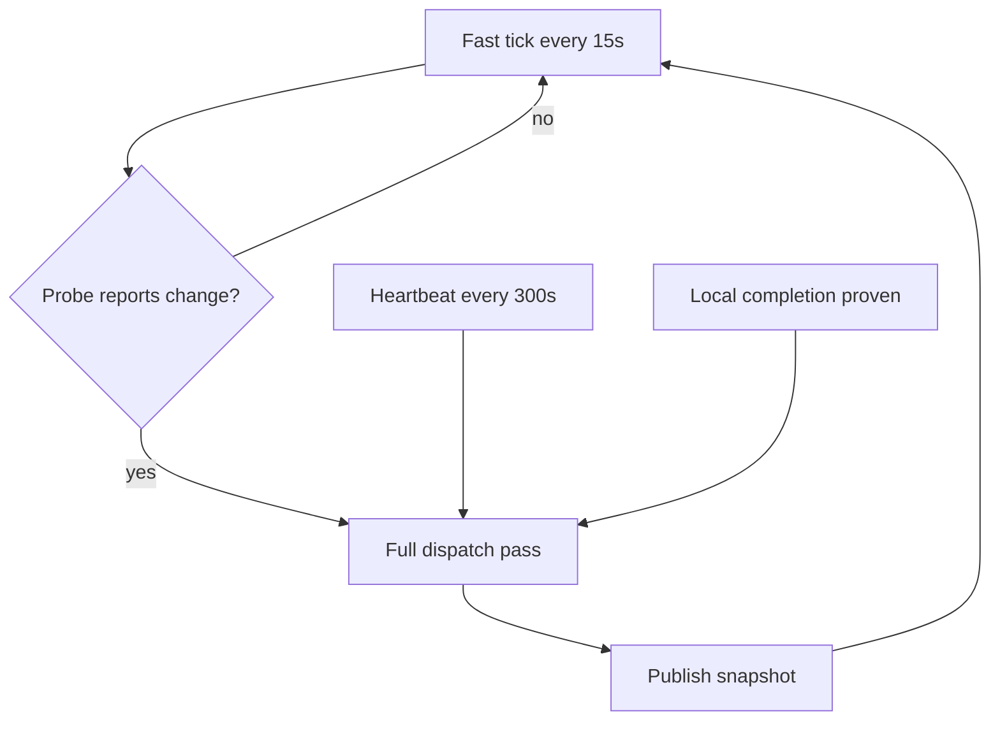
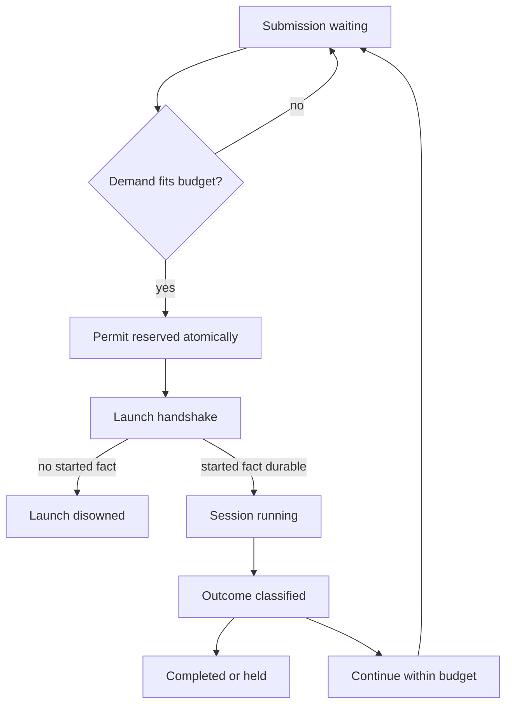

# The engine

*Why the pipeline behaves the way it does: the daemon's clocks, the coordinator, and dispatch.*

## The daemon

The daemon runs two clocks
([`daemon.py`](https://github.com/ConnorGriffin/agentflow/blob/main/agentflow/daemon.py)).

A **fast tick** every 15 seconds asks one cheap cross-fleet question through a
`ChangeProbe` — a single API call for the whole fleet. It triggers a full dispatch pass
only on three signals: the probe reports change, a local completion is proven, or the
heartbeat is due. A **heartbeat** every 300 seconds runs a full pass unconditionally, as
the backstop for whatever the probe misses — GitHub's search index lags, and the
heartbeat is what makes that lag survivable rather than fatal. The full pass runs in a
background thread under a single-flight lock, so the fast tick never blocks behind it.

Three properties round it out:

**Dormant by default.** An enable-flag file controls whether the daemon does anything.
Absent that flag, there are zero network calls between heartbeats.

**Single-instance lock.** A lock directory stamped with the owner's pid, heartbeated
every 60 seconds, is reclaimed only if it is stale past three hours or the pid is
provably dead. Two daemons never race.

**Local-completion wake.** A network-free process sweep over running records wakes a
full pass the moment a provider family is proven dead, so a finished session does not
wait out the heartbeat. It fails closed: unknown liveness is treated as alive.

The daemon wires together a small set of modules, each with one job: `dispatch.py`
discovers stage inputs and submits durable submissions but never starts a provider;
`coordinator/` owns records, budgets, and admission; `balancer.py` picks the
builder/reviewer pair; `routing.py` holds the capability ladder; `runner.py` handles
worktrees and preflight; `live.py` writes the atomic projections the console reads; and
`webapp.py` serves them.

## The coordinator

The coordinator's charter is one sentence: **one owner for one logical stage session**
([ADR 0030](https://github.com/ConnorGriffin/agentflow/blob/main/docs/adr/0030-session-coordinator-seam.md)).
It owns continuation records, the waiting queue, attempt budgets, the admission matrix,
atomic permit reservation, the crash-safe provider start handshake, outcome-first
classification, and reconciliation.

### The store

State lives in a private, versioned SQLite database at
`~/.agentflow/coordinator/records.db`. Permit-ledger writes happen under a single
`BEGIN IMMEDIATE` transaction, which is what makes it impossible for two coordinators to
over-reserve the same pool. The journal mode is deliberately not WAL: WAL would violate
a byte-identity invariant the refused-operations records depend on, and it is hostile to
read-only readers.

Concurrency is handled with a per-process lock on the shared connection plus a busy
timeout defaulting to 2000 ms. Past that timeout the store fails closed rather than
blocking a cycle — a stalled write is preferable to a stalled daemon.

### Permits and budgets

A **permit** is a unit of durable pool capacity. A session reserves its entire demand
atomically or not at all.

| Constant | Value |
|---|---|
| `PERMIT_BUDGET` (per pool) | 5 |
| `ATTEMPT_BUDGET` (per stage) | 3 |
| `RESTART_RESUME_CAP` | 5 |
| `REPAIR_BUDGET` | 1 |
| `MACHINE_CEILING` (concurrent root sessions) | 4 |
| Per-stage caps | triage 3, build 2, mockup/respond/research 1 |

The **admission matrix** is a static table of permit demand per
`(stage, pool, model, complexity, effort)`
([ADR 0029](https://github.com/ConnorGriffin/agentflow/blob/main/docs/adr/0029-static-per-pool-admission.md)).
It is a table rather than a heuristic on purpose: capacity decisions are reproducible and
testable. A Claude deep review costs 1 permit; the same review on Codex costs 2. Revise
costs 3 to 5. Build scales from 3 to 5 with the effort dial. A known pool row that is
missing falls back to the full pool budget — that is, an unpriced session takes the pool
exclusively rather than being guessed at.

`ATTEMPT_BUDGET = 3` means one initial launch plus at most two continuations per stage.
`RESTART_RESUME_CAP = 5` allows sessions killed by a daemon restart to resume without
being charged an attempt, but only five consecutive times before parking.
`REPAIR_BUDGET = 1` gives a clean exit that is missing a required outcome exactly one
targeted repair turn — and a malformed verdict earns one contract-repair turn rather
than an entire re-review.

### Scheduling

PR-bound stages (review, revise, respond) drain ahead of issue-bound stages (build,
mockup, intake) on the same pool
([ADR 0039](https://github.com/ConnorGriffin/agentflow/blob/main/docs/adr/0039-open-prs-drain-first.md)).
Getting an open pull request over the finish line outranks starting a new one, and the
tier is a pure function of the stage name rather than per-record state. Without this, a
single high-effort build could seize a whole pool and starve the review that would have
let it merge.

Code-writing stages are pinned to their tool lineage across continuations; review becomes
lineage-pinned once launched. And merges are serialized fleet-wide by a single
process-wide lock, so concurrent dispatch multiplies builds without ever multiplying
overlapping merges
([ADR 0009](https://github.com/ConnorGriffin/agentflow/blob/main/docs/adr/0009-collision-safety.md)).

### A submission's path

Reservation validates the waiting record inside the immediate transaction, sums demand
over the pool's running rows, and refuses if the total would exceed the budget. Durable
running rows are the only permit ledger; there is no separate counter that could drift.

## Dispatch, providers, and the capability ladder

Two provider pools exist: Claude and Codex. The **balancer** sends the builder to
whichever pool has more rate-limit headroom, and the reviewer is *always* the other tool
([ADR 0006](https://github.com/ConnorGriffin/agentflow/blob/main/docs/adr/0006-two-pool-runner-assignment.md)).
Cross-tool independence is not an option the balancer weighs; it is the constraint the
balancer optimizes under.

Claude dispatch authority comes from the provider's own five-hour quota reading plus a
paced seven-day allowance — the coordinator persists the provider's own numbers rather
than estimating them, and validates them fail-closed. An activity-adaptive ceiling
throttles a pool the operator is personally using, and an operator "floodgates" valve can
lift the weekly pace when a burst is wanted
([ADR 0025](https://github.com/ConnorGriffin/agentflow/blob/main/docs/adr/0025-activity-adaptive-spend-ceiling.md)).

### Session leads

Every Build and Revise launches a **session lead** — Claude/Fable or Codex/Sol — at low
reasoning effort
([ADR 498](https://github.com/ConnorGriffin/agentflow/blob/main/docs/adr/adr-498-capability-routed-session-led-dispatch.md)).
A session lead is an orchestrator that never writes code itself. It delegates down a
**capability ladder**: a provenance-stamped mapping of named models to provider CLI
identifiers, with recorded benchmark dates and prices, and per-area escalation ladders
for exploration, implementation, and review.

Escalation is bounded and explicit. The lead retries the same rung once after a failed
verification, escalates exactly one rung, and at the top of the ladder hands off both
failures rather than looping. Nothing in that path can silently spend its way upward.
