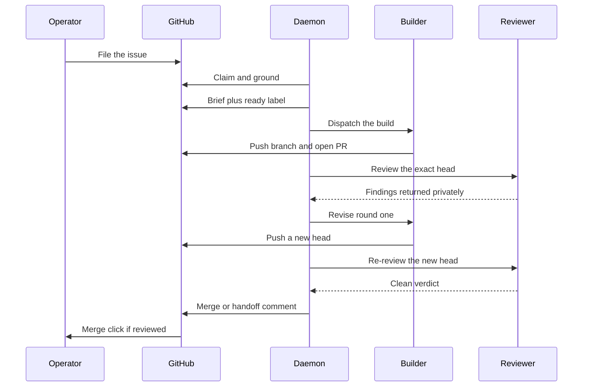

# Humans in the loop

*Every point where the pipeline requires or invites a person, from filing to merge to the console.*

## Where a human intersects

The complete list of points where the pipeline requires or invites a person:

1. **Enrollment and profile choice.** `agentflow enroll <path> --profile <profile>`.
   The choice of `autonomous`, `reviewed`, or `guarded` is a human judgment about domain
   risk. Enrollment is dry-run by default and requires `--apply`.
2. **Activation.** The daemon starts paused. `agentflow resume` is what permits cold
   submissions to start.
3. **Grilling replies.** An issue at `agentflow:needs-grilling` advances when a human
   answers the question in a plain GitHub comment, or drives it live with
   `/agentflow pickup <N>`.
4. **Mockup locks.** An issue at `agentflow:needs-mockup` is resolved only by a human
   `/ui-craft lock` session. No automated pass clears it.
5. **The merge click.** On `reviewed` and `guarded`, the human's only act is a glance
   and a merge click. `guarded` requires it unconditionally
   ([ADR 0017](https://github.com/ConnorGriffin/agentflow/blob/main/docs/adr/0017-guarded-auto-scope-human-merge.md)).
6. **Park resolution.** A park is a structured handoff addressed to a person; it does
   not clear itself.
7. **The unanswered-comment gate.** An unanswered maintainer comment on a PR blocks
   auto-merge outright. An open question from the person who merges means a reply, not a
   merge, is the next move.
8. **Forcing a same-tool review.** `/agentflow review <pr>` will run a review with the
   same tool that authored the change, after a warning and an explicit confirmation. The
   PR is then permanently **tainted** — human-merge-only — until the other tool cleanly
   reviews the exact head, which clears the taint automatically.
9. **Wayfinder dispositions.** Every closed research ticket needs a human ruling. The
   daemon never chooses among candidates.
10. **`agentflow:ignore`.** The unconditional opt-out.
11. **The console.** Read-only by construction; see below.

Interactive verbs — `enroll`, `pickup`, `triage`, `scope`, `build`, `review`, `revise` —
run exactly the same logic the daemon runs. Manual entry adds convenience, never
authority: safety gates are not skippable by driving a stage by hand
([ADR 0019](https://github.com/ConnorGriffin/agentflow/blob/main/docs/adr/0019-human-re-entry.md)).

## Timeline of a typical issue

The happy path with one revise round, as the five participants that matter see it.

Step by step, including where the branches fork off:

1. **Filed.** The operator, or a Wayfinder handoff, files an ordinary issue with no
   state label.
2. **Intake claim.** `agentflow:triaging` is applied before any grounding happens.
3. **Grounding.** The intake session reads the code, optionally pulls read-only real
   data, and verifies the premise.
4. **Route decided.** Ready, grill, or mockup. The triaging claim is released.
   *If held:* the issue stops here until a human replies or runs `/agentflow pickup`;
   the daemon re-checks on comment activity.
5. **Build claim and dispatch.** `agentflow:building` is applied, and a provider pool
   with headroom is chosen.
6. **Build.** An isolated worktree, the Brief as the only input, a pull request on a
   branch named `agentflow/<tool>/issue-N-*`.
7. **Review.** The cross-tool reviewer inspects the exact pushed head at an assigned
   depth, and may ship a clear fix itself.
8. **Revise.** Up to two logical revise rounds. *If exhausted:* park.
9. **Gate decision.** The pure `decide_merge` check runs: reply pending, reviewer
   independence, parsed verdict, UI evidence, CI green, clean verdict.
10. **Outcome.** On `autonomous` and clean, a squash-merge and released labels. On
    `reviewed` or `guarded`, a clean-review summary comment and a waiting merge click.
    On anything unresolved or exhausted, a two-section park comment.
    *If parked:* the operator resolves it on GitHub or with `/agentflow revise <PR>`.
11. **Merge lands.** Merges are serialized fleet-wide, so two pull requests never
    squash-merge at the same instant.

Recovery runs underneath all of this. A crash or interruption resumes from durable
coordinator records rather than replaying from the top, and restarts never duplicate
comments, labels, issues, attempts, or claims.

## When things stop

A **park** is a deliberate, durable stop with a written handoff. Every park comment has
exactly two sections:

- **Maintainer decision needed** — the behavior in question, the options, the
  consequences of each, and a recommendation.
- **Agent handoff** — code locations, conflicting changes, check results, what work was
  retained, and the exact next action.

Only final outcomes are public. Intermediate review findings stay private, so the issue
thread does not fill with a machine arguing with itself.

The main causes of a park:

- **Revise exhaustion** — two unproductive revise rounds.
- **Recovery exhaustion** — the attempt or continuation budget is spent with no new
  state to work from.
- **Review disagreement** — a reviewer-fix and re-review chain that keeps changing the
  code parks after three consecutive change-making passes.
- **Missing UI evidence** — a declared UI surface changed with no screenshot. This gate
  is mechanical and unwaivable; a reviewer who waves it through cannot clear it.
- **A red check on the reviewed commit** — an `action_required` check parks immediately.
- **Merge failure** — a failed squash-merge parks with the explicit reason. There is no
  blind retry.
- **Conflict-resolution failure** — two genuinely competing product intents.
- **Research exhaustion** — an unattended research run that ended without a ruling the
  contract accepts gets one durable park comment naming the refusing check, plus
  `wayfinder:parked`, which takes it permanently out of unattended selection.

One case that deliberately does *not* park: if the cross-tool reviewer is unavailable,
an autonomous pull request holds open indefinitely without consuming capacity. It
neither fails nor parks — it waits for the other tool to become available.

!!! note "Pause is not drain"
    `agentflow pause` stops cold submissions, but heartbeats keep observing and
    finalizing existing work. A drain is complete only when no non-retired record is
    waiting or running. Killing the process is not a drain.

## The console

The console is a read-only projection. It has no mutation path into the pipeline; every
actionable state deep-links out to GitHub, a chat session, or the CLI
([ADR 0035](https://github.com/ConnorGriffin/agentflow/blob/main/docs/adr/0035-workflow-engine-read-only-operator-console.md)).

It shows a fleet home — exceptions, live sessions, capacity, recent landed changes — and
a per-repository view with decision maps, build issues, blockers, and landed evidence.
Its pages are Inbox, Live, Fleet, History, Workspace, and Briefing. It binds to loopback
and runs under its own service, so pausing dispatch does not stop the console.

The important architectural fact is that the web server never queries GitHub. The daemon
produces a snapshot every cycle — including while dormant, because dormant is exactly
when the operator is watching — and writes it atomically to a state file. The server
reads that file
([ADR 0026](https://github.com/ConnorGriffin/agentflow/blob/main/docs/adr/0026-daemon-owned-snapshot.md)).
Freshness is reported honestly rather than enforced: if the daemon is down, the last
snapshot is served with its real age attached, and a missing file reads as an empty
fleet rather than an error.
