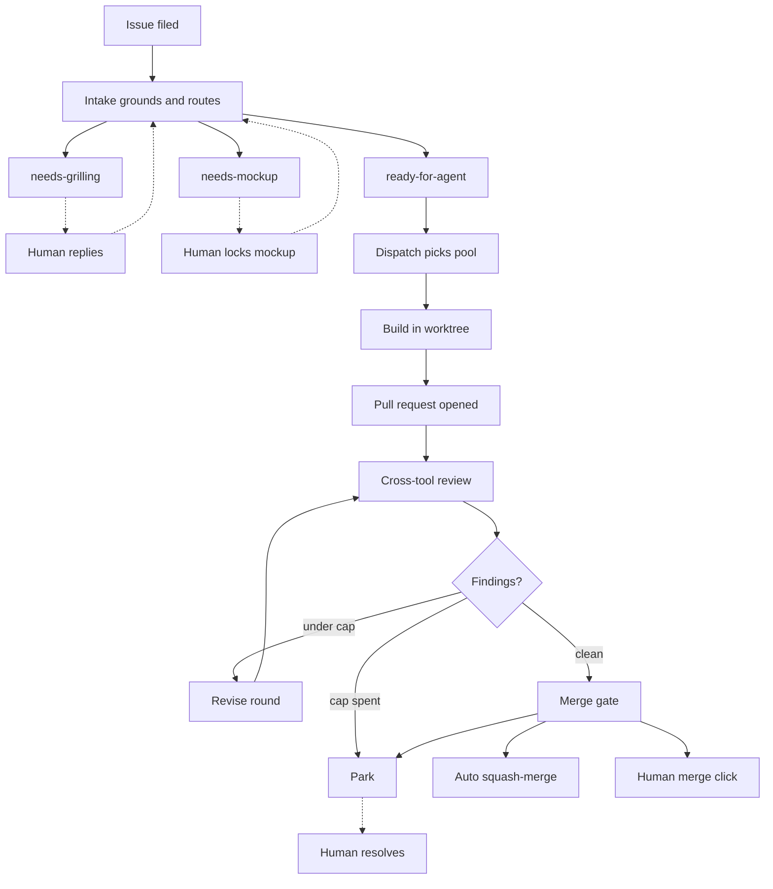

# How AgentFlow works

AgentFlow is an unattended GitHub issue → pull request engine for one operator. It
grounds an approved issue against the real code, builds it in an isolated worktree,
reviews the exact commit that was pushed, and applies the repository's merge policy.
GitHub and the repository stay the durable authority throughout; AgentFlow executes
ordinary build issues and does not own planning conversations, issue tracking, or
repository decisions.

!!! note "How to read this page"
    **[The operator's view](operators-view.md)** and **[Humans in the loop](humans-in-the-loop.md)**
    are for anyone who files work and watches it land. Together they cover what a Build
    Issue is, how intake routes it, what the labels mean, how autonomy profiles change
    the ending, and exactly where a human is required.

    **[The engine](engine.md)**, **[Building and reviewing](building-and-reviewing.md)**,
    and **[State, tags, and learning](state-and-learning.md)** are for anyone who wants
    to know why it behaves that way: the daemon's clocks, the coordinator's permits and
    budgets, slicing, build isolation, review machinery, the merge gate, and persistence.

    You can stop after the operator-facing pages and still operate the system correctly.

## The 60-second version

Everything below is an expansion of one path. An issue is filed with no state label.
Intake grounds it against the code, rewrites it into something specific, and routes it
to exactly one of three outcomes. Only one of those three routes is buildable; the other
two are holds that wait for a human. A buildable issue is dispatched to whichever
provider pool has headroom, built in its own worktree, and opened as a pull request. The
*other* tool reviews the exact pushed commit. Findings become bounded revise rounds. A
pure gate then decides merge, revise, or park.

The dotted edges are the human-touch branches. Every one of them is a deliberate stop:
the engine has reached a point where a machine answer would be a guess, so it writes
down what it knows and waits. The solid path from `ready-for-agent` to a merge or a
handoff comment runs unattended.

## Find your way around

- [The operator's view](operators-view.md) — filing work, intake and its three routes,
  the label taxonomy, and autonomy profiles.
- [Humans in the loop](humans-in-the-loop.md) — where a human intersects, a typical
  issue's timeline, when things stop, and the console.
- [The engine](engine.md) — the daemon, the coordinator, and dispatch, providers, and
  the capability ladder.
- [Building and reviewing](building-and-reviewing.md) — slicing, build isolation,
  review machinery, and the merge gate.
- [State, tags, and learning](state-and-learning.md) — state and persistence, tags, and
  the learning pipeline.
- [Pitfalls and future work](pitfalls.md) — pitfalls and sharp edges, where it could go
  next, and further reading.
