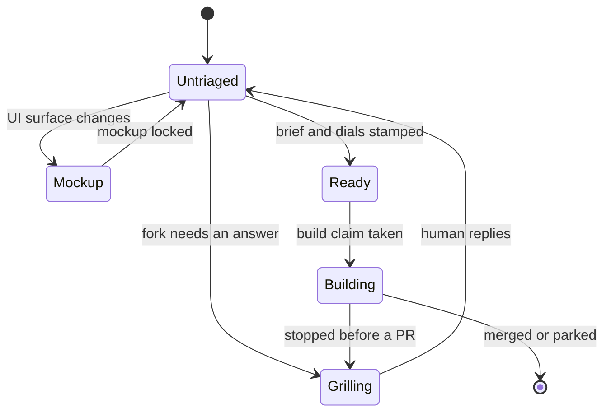

# The operator's view

*What it's like to file work, watch intake route it, and see it built under an autonomy profile.*

## Filing work

The unit of work is a **Build Issue**: one operator-approved, independently buildable
GitHub issue that enters intake. That definition is doing real work. "Independently
buildable" means the issue can be finished without waiting on a decision that has not
been made yet. "Operator-approved" means the decision to do this work has already
happened, outside the engine.

This is the planning/execution boundary, and it is the product's central promise.
Uncertainty is explored upstream, in a chat session, under the
[Wayfinder](https://github.com/ConnorGriffin/agentflow/blob/main/docs/adr/0027-wayfinder-planning-boundary.md)
boundary:

```text
uncertainty → Wayfinder decision map → clear Build Issue → AgentFlow pipeline
```

Wayfinder never executes. When planning turns up a world-changing prerequisite, that
prerequisite becomes its own ordinary Build Issue. Issues handed off this way carry
their resolved decisions in the body and deliberately do **not** carry a `wayfinder:*`
label, so normal intake picks them up and grounds them like anything else.

!!! important "There is no second approval inside AgentFlow"
    Once an issue is filed, no further human confirmation is solicited before work
    starts. The approval happened when the issue was written. A proposal to stamp
    handed-off tickets `ready-for-agent` directly was
    [rejected](https://github.com/ConnorGriffin/agentflow/blob/main/docs/adr/0027-wayfinder-planning-boundary.md):
    it would bypass grounding, the Agent Brief, and the dials — the three things that
    make an issue safe to build unattended.

## Intake and the three routes

Intake fires on every open issue that has no state label, excluding `wayfinder:*`
planning artifacts. It does three things in order
([ADR 0016](https://github.com/ConnorGriffin/agentflow/blob/main/docs/adr/0016-intake-stage.md)):

**Ground.** *Grounding* means re-deriving the issue's claims against the actual code
rather than trusting the prose. The intake session reads deeply, and may pull a fresh
read-only snapshot of real data to check that the numbers in the issue are the numbers
in the system. An issue whose premise turns out to be false does not become a build.

**Rewrite.** The title and description are made specific. The original title is
preserved in the body as `> Retitled from: "…"`, and the issue as filed is kept under a
collapsed details block. Nothing the human wrote is destroyed; it is demoted.

**Route.** Exactly one of three mutually exclusive state labels is applied.

| Route | What it means |
|---|---|
| `ready-for-agent` | Build-ready. Brief written, dials stamped. |
| `agentflow:needs-grilling` | A real, outcome-changing fork intake cannot settle. |
| `agentflow:needs-mockup` | A user-facing surface beyond a minor bugfix. |

The grilling route is not "intake got confused." It is reserved for a fork where two
defensible answers produce genuinely different software. The mockup route holds work
that would change a user-facing surface until a `/ui-craft lock` pass has fixed what
that surface should look like.

### The Agent Brief

An issue routed `ready-for-agent` gets an **Agent Brief** written into its body. The
Brief is the single build input for every profile — not the original issue text, not a
chat transcript, not a plan file. It has fixed sections:

- **Summary** — what is being built.
- **Verified** — claims re-derived against named code and data, with real numbers.
- **Current behavior** and **Desired behavior**.
- **Key interfaces** and **Interface shape**.
- **Acceptance criteria** — checkboxes with grounded numeric literals and a regression test.
- **Out of scope** — what this build must not touch.

The acceptance criteria matter more than they look. Review is anchored to them
([ADR 0015](https://github.com/ConnorGriffin/agentflow/blob/main/docs/adr/0015-review-anchors-to-acceptance.md)),
so a criterion that is vague produces a review that is vague.

### The two dials

Intake stamps two dials, and only ever on the ready route
([ADR 0018](https://github.com/ConnorGriffin/agentflow/blob/main/docs/adr/0018-two-dials-review-by-evidence.md)).
A **dial** is a label that sizes the work rather than describing it.

- `agentflow:complexity:standard|deep` — the model-size dial. This is a hard gate:
  no complexity label, no build. If two conflicting stamps end up on an issue, the more
  cautious one wins and it resolves to `deep`.
- `agentflow:effort:low|medium|high|extra` — how much room the work needs. Absent, it
  defaults to `medium`. This is guidance for ceilings and cost, not a hard gate.

### Fail-safe parsing

Intake's output parser is deliberately asymmetric. Anything that is not confidently
`ready` or `mockup` becomes a hold — the grill route — never an accidental build. A
`ready` route arriving with a missing or invalid complexity dial is an explicit invalid
result; it is never silently upgraded to a default. Malformed output, missing dials, and
unreadable routes all converge on the same place: a human-visible hold.

The rule is that ambiguity holds. The engine would rather stop and ask than build the
wrong thing quietly.

## The label taxonomy

Every canonical label string lives in one module,
[`labels.py`](https://github.com/ConnorGriffin/agentflow/blob/main/agentflow/labels.py),
so a lane's claim is named the same way wherever it is taken, proved, or released.

| Label | Meaning |
|---|---|
| `ready-for-agent` | State: build-ready, brief and dials present |
| `agentflow:needs-grilling` | State: held for a human answer |
| `agentflow:needs-mockup` | State: held for a UI lock pass |
| `agentflow:complexity:standard` | Dial: standard model tier |
| `agentflow:complexity:deep` | Dial: deep model tier |
| `agentflow:effort:low` … `:extra` | Dial: how much room the work needs |
| `agentflow:mockup:local` / `:surface` | Dial: a parked mockup's reopening scope |
| `agentflow:triaging` | Claim: an intake session owns this issue |
| `agentflow:building` | Claim: an agent is building this issue |
| `agentflow:drawing-mockup` | Claim: a session is drawing variants |
| `wayfinder:resolving` | Claim: shared, human or daemon, on a planning ticket |
| `agentflow:ignore` | Opt-out: never admit this issue unattended |
| `wayfinder:research` | The one AFK-able planning ticket the daemon may run |
| `wayfinder:awaiting-disposition` | Research finished; needs an operator ruling |
| `wayfinder:parked` | Unattended research ended without an acceptable ruling |
| `wayfinder:grilling` / `:prototype` / `:task` | Planning types the daemon never dispatches |

Three groups behave differently:

**State labels** are intake-owned and mutually exclusive. The two held states are inert
to agents — no automated pass advances them. Only human re-entry does, via a plain
GitHub comment reply or `/agentflow pickup`
([ADR 0019](https://github.com/ConnorGriffin/agentflow/blob/main/docs/adr/0019-human-re-entry.md)).

**Claim labels** express lane ownership. A claim is applied *before* the owning session
runs and released once its outcome is durable. That ordering closes the window between
"this issue was selected" and "this issue has state" during which a second dispatch pass
could pick up the same work
([ADR 0021](https://github.com/ConnorGriffin/agentflow/blob/main/docs/adr/0021-dispatch-dedup-build-claim.md)).

**`agentflow:ignore`** is neither a pipeline state nor an ownership claim. It is an
operator veto: this issue is never admitted unattended, whatever else is true about it.

### State-label transitions



The transition worth noticing is `Building → Grilling`. If a build stops before it has
produced a pull request, the issue is routed back to `needs-grilling` rather than left
sitting at `ready-for-agent`. Leaving it ready would mean the next dispatch pass tries
the same thing again with the same information; routing it to a hold puts the failure in
front of a human.

## Autonomy profiles

Every enrolled repository declares exactly one **autonomy profile** through a `profile:`
line in its `AGENTS.md` or `CLAUDE.md`. The profile is a single coupled dial that moves
grounding rigor, review requirements, and merge authority together
([ADR 0002](https://github.com/ConnorGriffin/agentflow/blob/main/docs/adr/0002-three-autonomy-levels.md)).

| Profile | Review and merge |
|---|---|
| `autonomous` | Cross-tool exact-head review; auto-merge on green CI and a clean untainted verdict |
| `reviewed` (default) | Cross-tool review when available, explicit same-tool fallback; a human glances and merges |
| `guarded` | Mandatory real-data or running-app grounding; dual or human review; a human always merges |

What sets the profile is **domain risk** — the cost of a plausible-looking wrong merge —
and nothing else
([ADR 0001](https://github.com/ConnorGriffin/agentflow/blob/main/docs/adr/0001-per-repo-autonomy-profile.md)).
Not which tool is doing the work, not how mechanical the change looks, not how confident
the last few builds were. A one-line change to a payments path is high-risk; a
sprawling refactor of a toy is not.

The enforcement is mechanical rather than advisory. In `coordinated_review.py`, the
merge branch is gated on `profile == "autonomous"`. A non-autonomous repository reaches
a different branch entirely: post the clean-review summary, hand off to the human, stop.
`squash_merge` is not something a `reviewed` repository declines to call — it is
something a `reviewed` repository never reaches.

### The trust ratchet

Repositories loosen toward autonomy only as staged decisions are consistently confirmed
([ADR 0007](https://github.com/ConnorGriffin/agentflow/blob/main/docs/adr/0007-decisive-intake-graduated-autonomy.md)).
The ratchet is deliberate, reversible, and per-repository. It is never a default and
never automatic; nothing in the engine promotes a repository on its own.

!!! note "AgentFlow runs `reviewed` on itself"
    This repository is enrolled in its own fleet, and its profile is `reviewed`. The
    reason is written in its `AGENTS.md`: changes to the merge machinery are
    correctness-sensitive, so a human merges changes to the thing that decides merges.
    The engine is not trusted to auto-merge changes to its own trust boundary.
